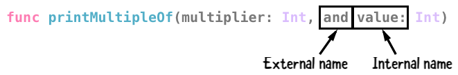
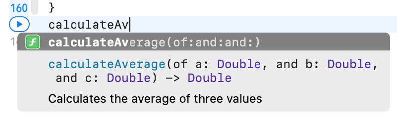
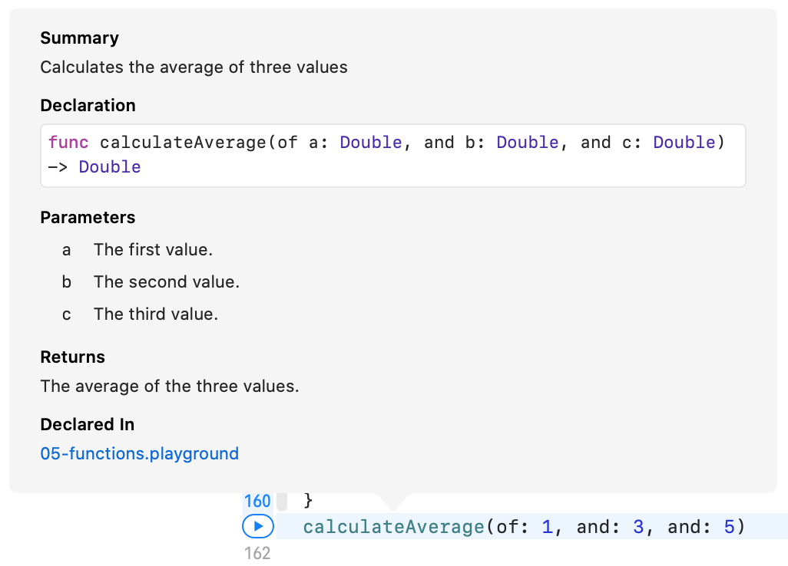

# 5 Functions

## Function basics

다른언어와 마찬가지로 빈번하게 사용되는 코드를 묶어 간단하게 호출해서 사용하기위해 함수를 이용한다. 

```swift
// func declaration
func printMyName() {
  print("My name is Matt Galloway.")
}

```

`func` 키워드로 함수를 선언할수 있으며 이름을과 괄호를 이용해서 함수를 호출할수 있다. 

### Function parameters

```swift
func printMultipleOfFive(value: Int) {
  print("\(value) * 5 = \(value * 5)")
}
printMultipleOfFive(value: 10)

```

함수에 파라미터를 추가하고 싶을때는 괄호안에 `parameterName: type` 을 추가해서 파라미터를 받을수 있다. 

- Note: 함수안의 괄호에 parameter list로 추가되는게 `parameter` 이고 함수를 호출할때 전달하는 값이   à `argument` 이다.

```swift
func printMultipleOf(multiplier: Int, and value: Int) {
  print("\(multiplier) * \(value) = \(multiplier * value)")
}
printMultipleOf(multiplier: 4, and: 2)

```

Swift에선 함수 파라미터에 `external name`을 부여할수 있다. 단순히 아까 Parameter의 정의에 이름을 추가해주면 된다. 코드의 가독성을 높이기 위해 추천된다! 



```swift
func printMultipleOf(_ multiplier: Int, and value: Int) {
  print("\(multiplier) * \(value) = \(multiplier * value)")
}
printMultipleOf(4, and: 2)

```

`_` 키워드를 external name의 위치에 이용하면 함수호출시에 parameterName을 생략할수 있다.

```swift
func printMultipleOf(_ multiplier: Int, _ value: Int = 1) {
  print("\(multiplier) * \(value) = \(multiplier * value)")
}
printMultipleOf(4)

```

물론 parameter에 default 값을 할당하는것도 가능하다.

### Return values

값을 리턴해주고 싶을때는 간단히 `-> Type` 을 함수 declaration옆에 추가하고 `return` 키워드로 리턴값을 지정해줄수 있다.

```swift
func multiply(_ number: Int, by multiplier: Int) -> Int {
  return number * multiplier
}
let result = multiply(4, by: 2)

func multiplyAndDivide(_ number: Int, by factor: Int)
                   -> (product: Int, quotient: Int) {
  return (number * factor, number / factor)
}
let results = multiplyAndDivide(4, by: 2)
let product = results.product
let quotient = results.quotient
```

물론 이전에 배웠던 ``Tuple` 도 리턴타입으로 사용가능하며 naming하는것도 그대로 사용가능하다.

```swift
func multiply(_ number: Int, by multiplier: Int) -> Int {
  number * multiplier
}

func multiplyAndDivide(_ number: Int, by factor: Int)
                   -> (product: Int, quotient: Int) {
  (number * factor, number / factor)
}

```

또 단순히 함수가 한줄로 이루어져있다면 `return` 키워드를 굳이 명시하지 않아도 값을 리턴해줄수 있다. 

### Advanced parameter handling

기본적으로 함수안의 parameter는 ``let` 키워드로 선언된것과 다름 없다고 생각하면 된다. 함수내에서 값의 수정이 불가능하다. Swift는 기본적으로 함수안으로 들어오는 값을 넘겨주기전에 copy해서 넘겨주는데 이를 `Pass by Value` 라고 한다!

```swift
func incrementAndPrint(_ value: Int) {
  value += 1
  print(value)
}

```

- Note: 물론 뒤에배울 `class` 는 값이 복사가아닌 레퍼런스가 넘겨진다.

기본적으로 값이 바뀌지 않도록 하는 이유는 의도치않은 값의 변경을 통해 발생하는 오류를 막기위해서다.

하지만 만약! 값을 집적적으로 바꿔주고 싶을때는 `inout` 키워드를 이용하면 된다. 파라미터의 type앞에 키워드를 추가해서 설정하며 이걸 `copy in copy out` 또는 `call by value result` 라고 한다.

```swift
func incrementAndPrint(_ value: inout Int) {
  value += 1
  print(value)
}

```

inout키워드가 의미하는건 저 parameter는 함수내부로 들어올때 local copy되서들어오고(`ìn`) 함수가 return과 동시에 다시그 로컬카피가 복사되서 나간다(`out`)는 뜻이다. 함수를 호출할때는 inout되는 파라미터앞에 `&` 키워드를 추가해줘야한다! 

```swift
var value = 5
incrementAndPrint(&value)
print(value)

```

특정조건에서 컴파일러는 이런 copy-in, copy-out을 최적화 할수 있는데 copy대신에 단순히 주소값으로 접근하는 방법으로 `pass by referance` 라고한다. parameter가 argument로 주어진 value의 값대신 메모리주소의 레퍼런스를 가지게되며 이경우 copy in copy out의 결과를 만족하면서 copy의 필요성이 없어진다.

### Overloading

```swift
func printMultipleOf(multiplier: Int, andValue: Int)
func printMultipleOf(multiplier: Int, and value: Int)
func printMultipleOf(_ multiplier: Int, and value: Int)
func printMultipleOf(_ multiplier: Int, _ value: Int)

```

동일한 함수이름이더라도 아래 조건에 의해 다른함수처럼 취급할수 있다.

- parameter 수가 다른경우
- parameter type이 다른경우
- parameter의 external name이 다른경우

return type이 다른경우에도 overloading을 적용할수 있으나, 타입추론을 더이상지원할수 없게 되기때문에 추천되는 방법은 아니다 사용을 위해서는 타입을 반드시 명시해줘야한다.

```swift
func getValue() -> Int {
  31
}

func getValue() -> String {
  "Matt Galloway"
}

let value = getValue()
// error: ambiguous use of 'getValue()'

let valueInt: Int = getValue()
let valueString: String = getValue()
```

## Function as variables

Swift에서는 함수도 변수로 취급된다. 아래처럼 작성한뒤 option을 통해 확인하면 function변수가 `(Int,Int) -> Int` 로 추론된걸 확인할수 있다. 또한 기존 `add` 를 호출하는것첢 ``function` 을 사용할수 있다.

```swift
func add(_ a: Int, _ b: Int) -> Int {
  a + b
}
var function = add
function(4, 2)
```

같은타입의 다른 함수도 할당가능하다.

```swift
func subtract(_ a: Int, _ b: Int) -> Int {
  a - b
}
function = subtract
function(4, 2)
```

이말은 함수를 다른함수의 parameter로 전달하는것도 가능하단 뜻이다.

```swift
func printResult(_ function: (Int, Int) -> Int, _ a: Int, _ b: Int) {
  let result = function(a, b)
  print(result)
}
printResult(add, 4, 2)

```

### The land of no return

몇몇함수는 절대 종료되지 않는, return 되지 않는 함수가 있을수도 있다. (휴대폰에서 화면의 터치를 감지하는 함수를 떠올려보자) 이런경우에 함수에 `Never` 키워드를 명시함으로써 함수가 return되지않음을 컴파일러에게 알리고 컴파일러는 그에따른 최적화를 해줄수있다.

```swift
func noReturn() -> Never {

}

```

``Never` 키워드를 쓴경우에는 함수가 절대 return 되지않음을 다른 return되지않는 함수를 이용해 보장해야한다. 위코드 같은경우는 return 되기 때문에 오류가 발생하고 리턴되지 않는 일반적인 예를 들면 아래와같다.

```swift
func infiniteLoop() -> Never {
  while true {
  }
}

```

### Writing a good function

함수는 여러문제를 해결하게 해주지만 좋은 함수는 하나의 간단한 task를 맡는것이다. 함수가 mix,match되고 더 복잡한 업무를 할수 있도록 작성해야한다.

또 잘정의된 인풋을 받아 항상 같은 아웃풋을 낼수있도록 해야한다.

## Commenting your functions

Xcode에서 `option+cmd+/` 을 이용하면 함수에 대한 주석을 쉽게 달수있다. 기본적으로 `Doxygen` 주석 스타일을 제공하며 함수에대한 설명, 각 parameter에 대한 설명, return 값에대한 설명으로 이루어진다. 이렇게 작성된 주석은 Xcode에서 자동으로 인식해 함수명에 option을 가져다대면 이 주석을 보여준다.

```swift
/// Calculates the average of three values
/// - Parameters:
///   - a: The first value.
///   - b: The second value.
///   - c: The third value.
/// - Returns: The average of the three values.
func calculateAverage(of a: Double, and b: Double, and c: Double) -> Double {
  let total = a + b + c
  let average = total / 3
  return average
}
calculateAverage(of: 1, and: 3, and: 5)

```

함수작성시에 간략한 설명을 제공한다.



option키를 누르고 선택하면 아래와같은 요약본을 보여준다.



자주사용되는 함수들에는 위처럼 주석을 다는것을 추천한다!


## Key points
* You use a function to define a task that you can execute as many times as you like without having to write the code multiple times.
* Functions can take zero or more parameters and optionally return a value.
* You can add an external name to a function parameter to change the label you use in a function call, or you can use an underscore to denote no label.
* Parameters are passed as constants, unless you mark them as inout, in which case they are copied-in and copied-out.
* Functions can have the same name with different parameters. This is called overloading.
* Functions can have a special Never return type to inform Swift that this function will never exit.
* You can assign functions to variables and pass them to other functions.
* Strive to create functions that are clearly named and have one job with repeatable inputs and outputs.
* Function documentation can be created by prefixing the function with a comment section using ///.
