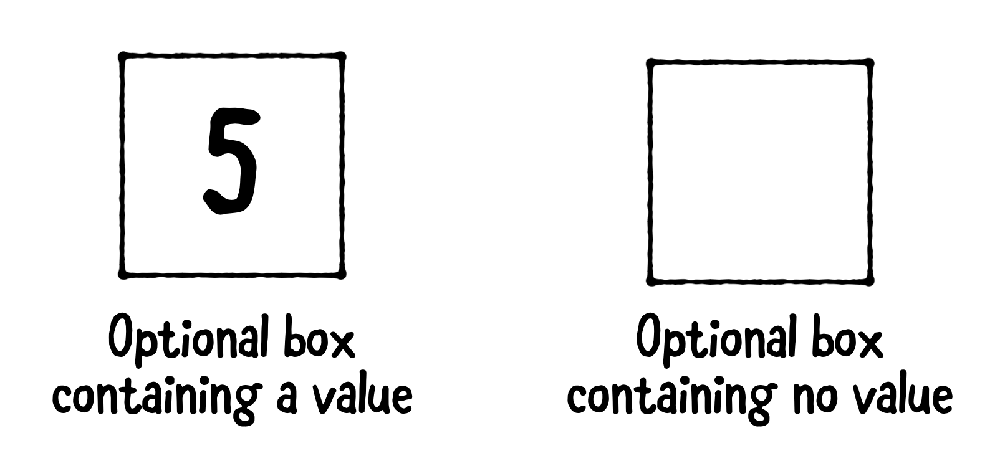
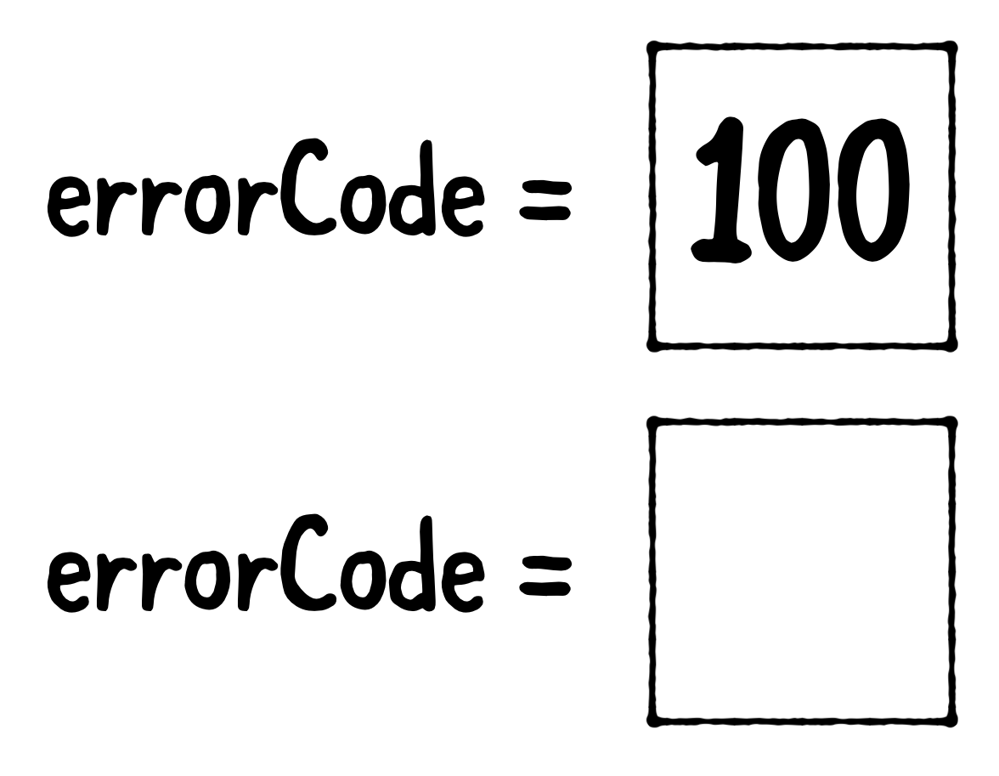

# 6 Optionals

Swift는 안전을위한 특징으로 Int든 String이든 type이 정의되면 반드시 값을 가진다. 하지만 코딩을 하다보면 값의 부재를 표현할 필요가 생기는데 이를 위해 스위프트가 제공하는 `value일 뿐만아니라 값이 없을수도 있는` optional을 소개한다.

## Introducing nil

사람을 이름,나이,직업으로 표현한다면 아래와같이 표현할수 있다.

```swift
var name = "Matt Galloway"
var age = 30
var occupation = "Software Developer & Author"

```

하지만 직업이 없는 사람은 어떻게 표현할수 있을까?

### Sentinel values

값의 부재를 표현할수 있는 특별한 값을 `setinel value` 라고 부른다. 아니면 단순히 special value라고 부르기도 한다.

```swift
var errorCode = 0
```

만일 서버로 요청을보내 응답을 얻어올때 에러가 없을때 에러의 개수가 0이라는 의미로 성공시 에러코드를 0으로 정의하자 하지만 서버구조가 바뀌면? 다른 프로그래머는 0을 유효한 에러코드로 쓰면? 

이런 문제때문에 정확히 `absence of value` 를 표현할수 있는 type이 필요함을 알수있다. 이런 타입이 있으면 컴파일러가 값이 존재하는경우, 없는경우에 우리를 위해 체크해줄수 있다!

Nil은 값이 존재하지 않음을 표현하는 단어인데 Swift에서는 값이 nil일 경우를 다룰수 있는 완전히 새로운 타입, `Optional`을 제시한다. 옵셔널은 sentianl value를 사용함으로써 오는 모호성을 없애준다! 

- 참고로 다른 언어 Objective-C에서도 `nil` 존재하긴 하지만 단순히 0의 동의어이다.. C도 마찬가지다! 이를개선한게 C++의 nulptr인가?

 

## Introducing optionals

옵셔널은 아까 설명했듯이 값이 존재하거나 존재하지 않거나를 다루는 Swift의 해결책이다! 



보통 상자로 비유해 상자안에 값이 들어있을수도 없을수도 이런식으로 나타낸다

선언은 기존 선언에 `?` 붙여서 만들수 있다. 이 경우 값이 `Int` 일수도 `nil` 일수도 있다!

```swift
var errorCode: Int?
```

- Note: ?를 이용해서 기존존재하는 어떤 타입도 옵셔널 타입으로 생성가능하며 기존 타입을 래핑한다고 생각하면 편하다.
- Note: 옵셔널 타입의 값은 non-optional type 또는 nil값의 초기값으로는 절대 타입추론 될수없다!

값의 할당을 그림으로 나타내면 아래와 같다.

```swift
errorCode = 100
errorCode = nil
```



## Unwrapping optionals

```swift
var result: Int? = 30
print(result)
```

옵셔널을 그대로 출력하면 우리가 생각한것과는 달리 `Optinal(30)` 이라고 출력한다. 값을 이용하기위해서는 언래핑 하는 과정이 필요하다.

- Note: 위 코드를 실행하면 컴파일러가 `Any` 의 자리에 `Optional` 이 왔다는 경고를 보낸다. 경고를 없애렴녀 `print(result as Any)` 로 코드를 변경할수 있다.

당연히 + 연산도 tpye이 다르기때문에 되지않는다.

```swift
print(result + 1)
// Value of optional type 'Int?' must be unwrapped to a value of type 'Int'
```

 

## Force unwrapping

언래핑하는 방법으로 `force unwrapping`이있다. `!` 키워드를 이용해서 할수 있지만 값이 존재하지 않는경우에는 컴파일러 에러를 낸다. 

```swift
var authorName: String? = "Matt Galloway"
var authorAge: Int? = 30

var unwrappedAuthorName = authorName!
print("Author is \(unwrappedAuthorName)")

var unwrappedAuthorName = authorName!
print("Author is \(unwrappedAuthorName)")
// Fatal error: Unexpectedly found nil while unwrapping an Optional value
```

그렇다면 어떻게 안전하게 언래핑할수 있을까?

```swift
if authorName != nil {
  print("Author is \(authorName!)")
} else {
  print("No author.")
}

```

위처럼 하면 안전하게 언래핑 할수있긴하지만 optional 타입에 대해 매번 위코드를 작성하는걸 까먹으면 안된다. 좀 귀찮은 일이기도 하고 까먹으면 에러를 뱉기 때문에 더좋은 방법을 살펴보자.

## Optional binding

Swift가 제공하는 옵셔널을 안전하게 래핑할수있는 방법이 바로 `optional binding` 이다. 값이 unwrapped되고 안에 저장되며 `if`   문에서 값이 존재할경우 `let`으로 선언된 constant에 묶인다. 만일 존재하지 않으면 `else` 로 빠져나가 수행된다.

```swift
if let unwrappedAuthorName = authorName {
  print("Author is \(unwrappedAuthorName)")
} else {
  print("No author.")
}
```

이름짓는게 귀찮기도 해서 보통은 이름 그대로 쓴다.

```swift
if let authorName = authorName {
  print("Author is \(authorName)")
} else {
  print("No author.")
}

```

`,` 로 연결해 여러개 값을 언래핑 할수도 있다.

```swift
if let authorName = authorName,
   let authorAge = authorAge {
  print("The author is \(authorName) who is \(authorAge) years old.")
} else {
  print("No author or no age.")
}

```

boolen condition도 추가할수 있다. 당연히 if 문의 모든 조건을 만족하지 않으면 어떤것도 언래핑되지 않는다.

```swift
if let authorName = authorName,
   let authorAge = authorAge,
   authorAge >= 40 {
  print("The author is \(authorName) who is \(authorAge) years old.")
} else {
  print("No author or no age or age less than 40.")
}

```

## Introducing guard

옵셔널 타입을 사용할때 컨디션을 체크하고 맞을경우만 계속 실행하고 싶은경우가 있을수 있다. 이럴때는 Swift의 다른 강력한 기능인 `guard` 문을 활용할수 있다. 

guard문 뒤에는 condition이나 optional binding등이 올수 있으며 `if let` 과의 차이는 `else` 로 들어갈경우 무조건 `return` 을 포함해야한다는 점이다. 만약 return을 명시하지않으면 컴파일러가 에러를 낸다.

```swift
func guardMyCastle(name: String?) {
  guard let castleName = name else {
    print("No castle!")
    return
  }

  // At this point, `castleName` is a non-optional String

  print("Your castle called \(castleName) was guarded!")
}

```

Guard문은 일단 가독성측면에서 좋다 조건을 만족하지 않으면 바로 return 되기 때문에 읽기쉽고 또 return 되지 않을경우 조건을 모두 만족한다는 점을 컴파일러가 알수 있기때문에 컴파일러가 최적화를 진행할수도 있다. 또 명시적인 `return`키워드덕에 함수의 나머지부분에서 condition이 모두 true인것을 보장함으로 나머지부분에서 그대로 사용이 가능하다!

`if let`  을 사용후 else에서 return을 써줄수도 있지만 `guard` 를 사용하면 return을 반드시 해줘야만 함으로 컴파일러가 확신을 가질수 있고 사용자에게 일종의 safety를 제공하게 된다.

실제 개발환경의 예제를 살펴보자. 아래처럼 `Int?` 타입을 리턴하는 함수가 있을때

```swift
func calculateNumberOfSides(shape: String) -> Int? {
  switch shape {
  case "Triangle":
    return 3
  case "Square":
    return 4
  case "Rectangle":
    return 4
  case "Pentagon":
    return 5
  case "Hexagon":
    return 6
  default:
    return nil
  }
}

```

`if let`을 사용하는것보다

```swift
func maybePrintSides(shape: String) {
  let sides = calculateNumberOfSides(shape: shape)

  if let sides = sides {
    print("A \(shape) has \(sides) sides.")
  } else {
    print("I don’t know the number of sides for \(shape).")
  }
}

```

`guard let`을 사용하는게 가독성이 올라간다.

```swift
func maybePrintSides(shape: String) {
  guard let sides = calculateNumberOfSides(shape: shape) else {
    print("I don’t know the number of sides for \(shape).")
    return
  }

  print("A \(shape) has \(sides) sides.")
}

```

함수가 복잡해질수록 guard 문은 빛을 발한다. Swift에서 굉장히 많이 사용되니 친숙해지자!

## Nil Coalescing

옵셔널을 언래핑하는 조금더 손이 덜가는 방법도 있다. default value를 이용해 옵셔널이 값이있던 없던 값을 꺼내고 싶을떄 사용할 수 있다. 이를 `nil coalescing`  이라고 한다

```swift
var optionalInt: Int? = 10
var mustHaveResult = optionalInt ?? 0

```

`??` 를 옵셔널 value 뒤에 명시하고 defaut 값을 적어줌으로써 사용할수 있다. 값이 있으면 해당값을 꺼내고, 없으면 default값을 할당한다.

nil coleasing이 없으면 코드가 아래처럼 더길어진다.

```swift
var optionalInt: Int? = 10
var mustHaveResult: Int
if let unwrapped = optionalInt {
  mustHaveResult = unwrapped
} else {
  mustHaveResult = 0
}

```

아래는 nil값이라서 default값인 0으로 mustHaveResult가 값이 바뀐다.

```swift
optionalInt = nil
mustHaveResult = optionalInt ?? 0

```

## Key points

- `nil` represents the absence of a value.
- Non-optional variables and constants are never `nil`.
- **Optional** variables and constants are like boxes that can contain a value ***or*** be empty (`nil`).
- To work with the value inside an optional, you must first unwrap it from the optional.
- The safest ways to unwrap an optional’s value is by using **optional binding** or **nil coalescing**. Use **forced unwrapping** only when appropriate, as it could produce a runtime error.
- You can `guard let` to bind an optional. If the binding fails, the compiler forces you to exit the current function (or halt execution). This guarantees that your program never executes with uninitialized value.

---

**‘Artwork/images/designs: from Swift Apprentice, available at [www.raywenderlich.com](http://www.raywenderlich.com/)”.’**
