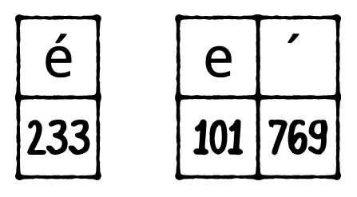
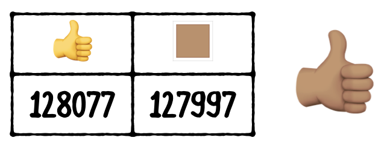
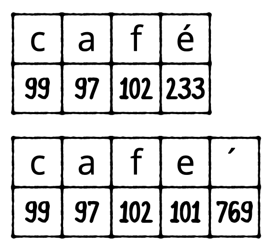
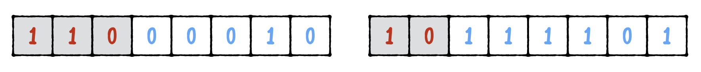
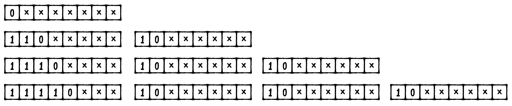

# 9 Strings

문자열을 굉장히 많이 쓰이는 데이터타입이다. 이번챕터에서는 string에 대해 일반적인, 깊은 짓기을 배운다. 어떻게 string이 Swift에서 동작하는지 배우게 되며 그걸통해 Swfit가 unicode set을 얼마나 빠른 속도로 처리하는 지 알게 될것이다.

## String as collections

Ch2에서 character set과 code point에 대한 내용르 배웠다. 그안을 조금더 들여다 보자.

string이 character의 collection이라는것은 이해하기 쉽다. 아래처럼 iteration을 할수도 있기 때문디ㅏ.

```swift
let string = "Matt"
for char in string {
  print(char)
}

```

이와비슷하게 count를 받아올수도 있지만 String에서 안되는게 있다. 바로 supscript이다. 

```swift
let stringLength = string.count

// Error
// 'subscript' is unavailable: cannot subscript String with an Int, see the documentation comment for discussion
let fourthChar = string[3]
```

이게 안되는 이유는 Character는 고정된 사이즈를 가지고 있지 않기 때문에 array처럼 index로 접근하지 못하기 때문이다. 왜 안될까? 조금더 살펴보기위해 `grapheme cluster`를 알아보자

### Grapheme clusters

알다시피 String은 Unicode character의 collection이다. 다만 여지껏 하나의 codepoint가 하나의 character에 대응된다고 배웠는데 실상은 그렇지 않다.

è 는 e 에 accent acuter를 붙여서도 나타낼수있다. 즉 è 의 표현은 앞의 character를 변환시키는 특별한 character, `combining character` 에 의해서 나타내질수도 있다.



`graphem cluster` 는 여기서 두번쨰그림을 나타내며(화면에 보이는 문자의 단위라고 보면 될것같다.) 사실 Swift에서의 character는 graphem cluster를 나타낸것이라 할수있다.

다른예로는 색이다른 이모지를 떠올릴수 있다.

!

그렇다면 이게 string을 collection으로 이용할때 어떤의미인지 살펴보자

```swift
let cafeNormal = "café"
let cafeCombining = "cafe\u{0301}"

cafeNormal.count     // 4
cafeCombining.count  // 4

```

둘다 카운트가 4로 동일하다 왜냐하면 Swift는 string을 graphem cluster의 collection으로 생각하기 때문이다. count를 세는대는 Linear time으로 graphem cluster를 세주면 되지만 이런 combining character 때문에 실제로 String이 메모리에서 얼마만큼의 사이즈를 가지는지는 알기 어렵다.

- Note: `\u{}` 는 유니코드를 쉽게 쓸수 있는 문법이다. {}안에는 16진수의 해당 character의 codepoint가 들어가며 301(16)은 769 accent accute이다(`)

하지만 `unicodeScalars` 를 이용하면 해당 string이 실제 몇개의 codepoint로 이루어졌는지도 확인할수 있다.

```swift
cafeNormal.unicodeScalars.count     // 4
cafeCombining.unicodeScalars.count  // 5

```

unicodeScarlars는 codepoint의 collection이므로 이터레이션도 가능하다.

```swift
for codePoint in cafeCombining.unicodeScalars {
  print(codePoint.value)
}

```

```swift
99
97
102
101
769

```

### Indexing strings

그렇다면 어떻게 string을 인덱싱 할수 있을까 스트링을 인덱싱하기위해서는 특별한 `string index type`이 필요하다.

```swift
let firstIndex = cafeCombining.startIndex
```

위는 `Int` 가 아닌 `String.index` 타입이다.

```swift
let firstChar = cafeCombining[firstIndex]
```

이렇게 얻은 string index를 가지고 해당 index의 `Chracter`(grapheme cluster)를 얻어올수 있다.

아래처럼 마지막 인덱스를 얻어올수도 있는데 endIndex는 말그대로 string의 끝이기 때문에 접근하면 에러를 낸다.

```swift
let lastIndex = cafeCombining.endIndex
// Fatal error: String index is out of bounds
let lastChar = cafeCombining[lastIndex]

```

아래처럼 접근해야 마지막 character르 ㄹ얻어올수 있다.

```swift
let lastIndex = cafeCombining.index(before: cafeCombining.endIndex)
let lastChar = cafeCombining[lastIndex]

```

중간에 위치한 character들은 다음과 같이 얻어올수 있다. 

```swift
let fourthIndex = cafeCombining.index(cafeCombining.startIndex,
                                      offsetBy: 3)
let fourthChar = cafeCombining[fourthIndex]

```

character(graphem cluster)를 얻어오는 것이므로 `è` 를 얻어오게 된다.

받아온 character를 string에 했던것처럼 `unicodeScalars` 동일하게 codepoint를 확인해보면 아래와 같다.

```swift
fourthChar.unicodeScalars.count // 2
fourthChar.unicodeScalars.forEach { codePoint in
  print(codePoint.value)
}

101
769
```

## Equality with combining characters

그렇다면 Swift는 컴바이닝 케릭터로 이루어진 카페와 그냥 케릭터로 이루어진 카페를 어떠게 볼까?

!

두 string은 보여지는 glyph가 같고 논리적으로 같기 때문에 Swfit에선 기본적으로 동일하게 취급된다.

```swift
let equal = cafeNormal == cafeCombining
```

Swift는 이런 비교를 위해 해당 String들을 동일한 형태의 String으로 변경후 비교하게 된다. 이런과정은 `canonicalization` 이라 부르며 기존 방법보다 3배정도 빠르다고 한다.. 아까 count수가 동일하게 4였던것도 canocialization을 거친 결과다.

## String as bi-directional collections

String의 리버스 버전을 얻고 싶을때는 어떻게 할까? 물론 역으로 순회 할수도 있지만 Swift는 더 간단한 해결책을 제공한다. `reversed()` 메서드이다.

```swift
let name = "Matt"
let backwardsName = name.reversed()

```

backwardName의 타입은 String일까? 아니다 `ReversedCollection<String>` 타입을 가지게 된다. 추가적으로 메모리를 사용해 새로운 변수를 할당하는게 아닌 기존 String에 역으로 순회할수 있게 해주는 얇은 wrapper를 제공한다고 생각하면 편하다.

비록 reversedCollection타입에서도 String과 동일한 방식으로 indexing이 가능하다.

```swift
let secondCharIndex = backwardsName.index(backwardsName.startIndex,
                                          offsetBy: 1)
let secondChar = backwardsName[secondCharIndex] // "t"

```

String을 얻고 싶으면 String으로 형변환이 필요하다. 

```swift
let backwardsNameString = String(backwardsName)
```

하지만 이경우에는 reverse된 새 String을 만들게 되고 추가적으로 메모리를 사용하게 된다. 진짜로 reverse된 스트링이 필요한게 아니라면 굳이 이럴필요는 없다.

## Raw strings

`raw string` 은 특정 케릭터나 스트링 interpolation을 피하고 싶을때 사용할수 있는 기법이다. 

```swift
let raw1 = #"Raw "No Escaping" \(no interpolation!). Use all the \ you want!"#
print(raw1)

```

 #으로 string의 양끝을 감싸면 되고 이경우에는 인터폴레이션이 적용되지 않아서 아래와 같은 결과를 얻게된다. 

```swift
Raw "No Escaping" \(no interpolation!). Use all the \ you want!
```

만약 raw string을 사용하지 않았더라면 no interpoltion! 이라는 변수가 없기 떄문에 컴파일 에러가 발생했을것이다.

감싸는 #의 수는 얼마가 되든 상관없다

```swift
let raw2 = ##"Aren’t we "# clever"##
print(raw2)

Aren’t we "# clever
```

raw stirng과 interplation을 동시에 사용하는것도 가능하다.

```swift
let can = "can do that too"
let raw3 = #"Yes we \#(can)!"#
print(raw3)

Yes, we can do that too!
```

## Substrings

Substring은 다른 collection과 마찬가지로 String.index를 이용한다는 점외에는 동일하게 사용가능하다.

```swift
let fullName = "Matt Galloway"
let spaceIndex = fullName.firstIndex(of: " ")!
let firstName = fullName[fullName.startIndex..<spaceIndex] // "Matt"

```

아래 보이는 `open-ended range` 를 적용할수도 있다. 이건 물론 다른 collection에도 사용가능하다.

```swift
let firstName = fullName[..<spaceIndex] // "Matt"
```

start index를 생략했지만 동일하게 동작한다.

반대쪽을 열어놓는것도 가능하다.

```swift
let lastName = fullName[fullName.index(after: spaceIndex)...]
// "Galloway"

```

한가지 알아야할점이 있는데 이렇게 구한 substring은 type이 `String`이 아니라는 점이다. 이전 컬렉션에서 subscripting을 수행한것과 마찬가지로 최적화를 위해 기본 String의 메모리를 공유하는 `String.Substring` (실제론 Substring 타입, 타입앨리어스로 저렇게됨)타입으로 만들어진다.

```swift
let lastNameString = String(lastName)
```

String을 원하면 String으로 형변환 하면 된다.  둘은 거의 모든 메서드를 공유하며 함수 파라미터로 넣거다 retrun해보기 전까진 이게 정확히 어떤 타입인지 헷갈리수도 있다.

## Character properties

`Character` 타입에는 많은 프로퍼티가 존재한다.

해당 케릭터가 `ASCII` 에 속하는지 확인할수 있다.

```swift
let singleCharacter: Character = "x"
singleCharacter.isASCII

```

- Note: ASCII 는 1960년대에 만들어진 고정 7 bit code 이다. UTF-8이 8bit를 이용하는 ASCII의 슈퍼셋으로 만들어졌다.

물론 위 예제는 `ture` 를 리턴한다. 이모지 같은걸넣으면 당연하게도 `false` 가 나온다.

해당 케릭터가 빈 스페이스인지도 체크가능하다.

```swift
let space: Character = " "
space.isWhitespace

```

또한 케릭터가 16진수에 속하는지도 출력가능하다.

```swift
let hexDigit: Character = "d"
hexDigit.isHexDigit

```

e 였다면 true를 출력한다.

해당 케릭터가 숫자인지도 당연히 확인가능하며 아래처럼 라틴 계역 숫자도 확인가능하다. 

```swift
let thaiNine: Character = "๙"
thaiNine.wholeNumberValue

```

위 케릭터는 9의 라틴숫자기 때문에 이것도 `true` 를 리턴한다. 

더많은 프로퍼티는 아래 url을 참고해라

[apple/swift-evolution](https://github.com/apple/swift-evolution/blob/master/proposals/0221-character-properties.md)

## Encoding

여지껏 String이 실제론 뭐고 어떻게 다뤄야되는지에 대해서는 배웠지만 어떻게 저장되고 엔코딩되는지를 배우지느 못했다. 그것에 대해 알아보자

String은 Unicode code points의 collection으로 이루어진다. 이코드 포인트들은 0에서 1114111까지 존재한다. (16진법으로 0x10FFFF) 즉 모든 코드 포인트를 표현하기 위해선 최소 21비트가 필요하다.

하지만 낮은 단위의 code point만 이용한다면 각 unicode point를 21비트로 나타내는것은 비효율적이다. 따라서 여러 bit의 유니코드 형식이 나타나게 되었다. (8 bit, 16 bit, 32 bit) 

이렇게 비트가 2의 배수인건 컴퓨터 연산이 2의 배수에 최적화 되어있기 때문이며 각각의 코드 포인트는 `UInt8` `UInt16`  `UInt32` 로 이루어져있으며 각각이 하나의 code unit, 즉 코드의 단위가 된다.

즉 스트링을 어떻게 저장할지는 어떤 엔코딩을 사용하냐는 말과 동일하다. `UTF-32`는 비효율적이라 잘 사용되지는 않는다.

### UTF-8

UTF-8은 자주이용되는데 기존 영어만 가능하던 7 bit의 ASKII 엔코딩과 바로 호환되서 사용되기 때문이다. UTF-8은 이름처럼 하나의 code unit이 8 bit이다.

UTF - 8 은 7 bit까지는 하나의 코드유닛을 사용하고 7비트를 넘어가는 코 두개의 code unit을 사용해 총 16비트로 나타낸다.

이때 맨 첫 코드유닛의 앞을 `110`  으로 채우고 두번째부터는 앞 두자리를 `10` 으로 채운다.

!

1~7 bit는 하나의 코드유닛 8~11bit를 이용하는 코드 포인트는 2개의 코드유닛, 12~16 비트는 세개 17~21비트는 4개를 이용한다

!

½을 나타내는(코드포인트 0x00BD) 를 utf8프로퍼티를 이용해 출력해보면 아래처럼 두개의 코드유닛을 이용해 이루어진것을 확인할수 있다.

```swift
let char = "\u{00bd}"
for i in char.utf8 {
  print(i)
}

194
189
```

코드포인트 0x00BD는 이진수로 10111101이고 8bit이기 때문에 

110 00010(194), 10 111101(189)로 나뉜다. 

+½⇨🙃 이경우에는 아래처럼 작성가능하다.

```swift
let characters = "+\u{00bd}\u{21e8}\u{1f643}"
for i in characters.utf8 {
  print("\(i) : \(String(i, radix: 2))")
}

43 : 101011

194 : 11000010
189 : 10111101

226 : 11100010
135 : 10000111
168 : 10101000

240 : 11110000
159 : 10011111
153 : 10011001
131 : 10000011
```

UTF - 8 은 32보다더 컴팩트하다. 4개의 코드 포인트를 표현하는데 10 바이트만 있으면 표현가능하다. 위 경우를 UTF - 32 로 표현했더라면 16바이트가 필요하다.

하지만 이경우에 단점이 존재하는데 위 예제에서 n번째 character를 찾으려면 charcter의 크기가 가변이므로 n-1번째 코드포인트까지의 모든 바이트를 검사해야 n번째가 시작하는 지점을 알아낼수있다. 고정크기가 아니므로 어디로 점프해야하는지 알기 어렵다.

### UTF - 16

UTF - 16 은 이름처럼 하나의 코드유닛에 16비트를 이용한다. 

그렇다면 16비트까지는 하나의 코드 유닛을 사용하지만 16비트를 넘어간다면 어떻게 처리할까? 17~21비트는 `surrogate pairs` 라는 방식을 도입해 처리한다. 

surrogate pair는 다음과 같은 방법으로 처리된다. 하나의 코드유닛을 high 서로게이트 레인지와 low 서로게이트 레인지로 나눈다.

- high  0xD800 ~ 0xDBFF
- low  0xDC00 ~ 0xDFFF

🙃 이렇게 생긴 코드 포인트(0x1F643)가 오면 다음과 같은 과정을거쳐 두개의 코드유닛으로 표현된다.

1. 0x10000을 코드포인트에서 뺀다. → 0xF643 (`0000 1111 0110 0100 0011` )
2. 이 20 개의 비트를 2개로 나눈다.→ `0000 1111 01` , `10 0100 0011` 으로 나뉜다.)
3. 첫번째부분에 0xD800을 더한다. → 0xD83D 이게 high  surrogate가 된다.
4. 두번째부분에 0xDC00을 더한다. → 0xDE43 이게 row  surrogate가 된다.

이렇게 16비트를 넘는 코드포인트는 위와같이 두개의 코드 유닛 `0xD83D` 와 `0xDE43` 으로 나누어 표현될수 있다.

```swift
for i in characters.utf16 {
  print("\(i) : \(String(i, radix: 2))")
}

43 : 101011

189 : 10111101

8680 : 10000111101000

55357 : 1101100000111101
56899 : 1101111001000011
```

아까와 동일한 string을 똑같이 utf16을 이용해 순회해보면 총 5개의 코드유닛으로 이루어진것을 확인할수 있다. 

이런식으로 UTF -16 을 이용하면 총 10 바이트 ( 한 코드유닛당 2바이트)를 이용하게 된다. UTF - 8가 동일한 메로리를 사용하는것처럼 보이지만 경우에 따라 다른 메모리 사용량을 보여준다.

Swift는 이렇게 String타입을 encoding별로 독립적으로 볼수 있는 거의 유일한 언어이며 내부적으로는 UTF 8 과 C언어의 `NULL` 종료 문자를 사용합니다.

### Converting indexes between encoding views

아까 사용한 예제에서 다음과 같이 해당 graphem cluster가 나타나는 인덱스를 찾을수 있다.

```swift
let arrowIndex = characters.firstIndex(of: "\u{21e8}")!
characters[arrowIndex] // ⇨

```

여기서 arrowIndex는 `String.Index` 타입인데 이를 해당 graphem cluster가 시작하는 unicodeScalars 상, 즉 utf8 utf16 상의 인덱스로 바꿍 가져올수도 있다.

아래예제를 보자.

```swift
if let unicodeScalarsIndex = arrowIndex.samePosition(in: characters.unicodeScalars) {
  characters.unicodeScalars[unicodeScalarsIndex] // 8680
}

if let utf8Index = arrowIndex.samePosition(in: characters.utf8) {
  characters.utf8[utf8Index] // 226
}

if let utf16Index = arrowIndex.samePosition(in: characters.utf16) {
  characters.utf16[utf16Index] // 8680
}

```

해당 인덱스로 해당 케릭터, graphem cluster가 시작되는 첫 코드유닛을 가져올수 있다. (기본 unicodeScalars는 코드 포인트를 무조건 한 코드유닛으로 표현한다.)

위에서부터 각 인덱스는 `String.UnicodeScalarView.Index` , `String.UTF8VIew.Index` , `String.UTF16View.Index` 로 구성된다.

## **Key points**

- Strings are collections of `Character` types.
- A `Character` is **grapheme cluster** and is made up of one or more **code points**.
- A **combining character** is a character that alters the previous character in some way.
- You use special (non-integer) indexes to subscript into the string to a certain grapheme cluster.
- Swift’s use of **canonicalization** ensures that the comparison of strings accounts for combining characters.
- Slicing a string yields a substring with type `Substring`, which shares storage with its parent `String`.
- You can convert from a `Substring` to a `String` by initializing a new `String` and passing the `Substring`.
- Swift `String` has a view called `unicodeScalars`, which is itself a collection of the individual Unicode code points that make up the string.
- There are multiple ways to encode a string. UTF-8 and UTF-16 are the most popular.
- The individual parts of an encoding are called **code units**. UTF-8 uses 8-bit code units, and UTF-16 uses 16-bit code units.
- Swift’s `String` has views called `utf8` and `utf16`that are collections that allow you to obtain the individual code units in the given encoding.
