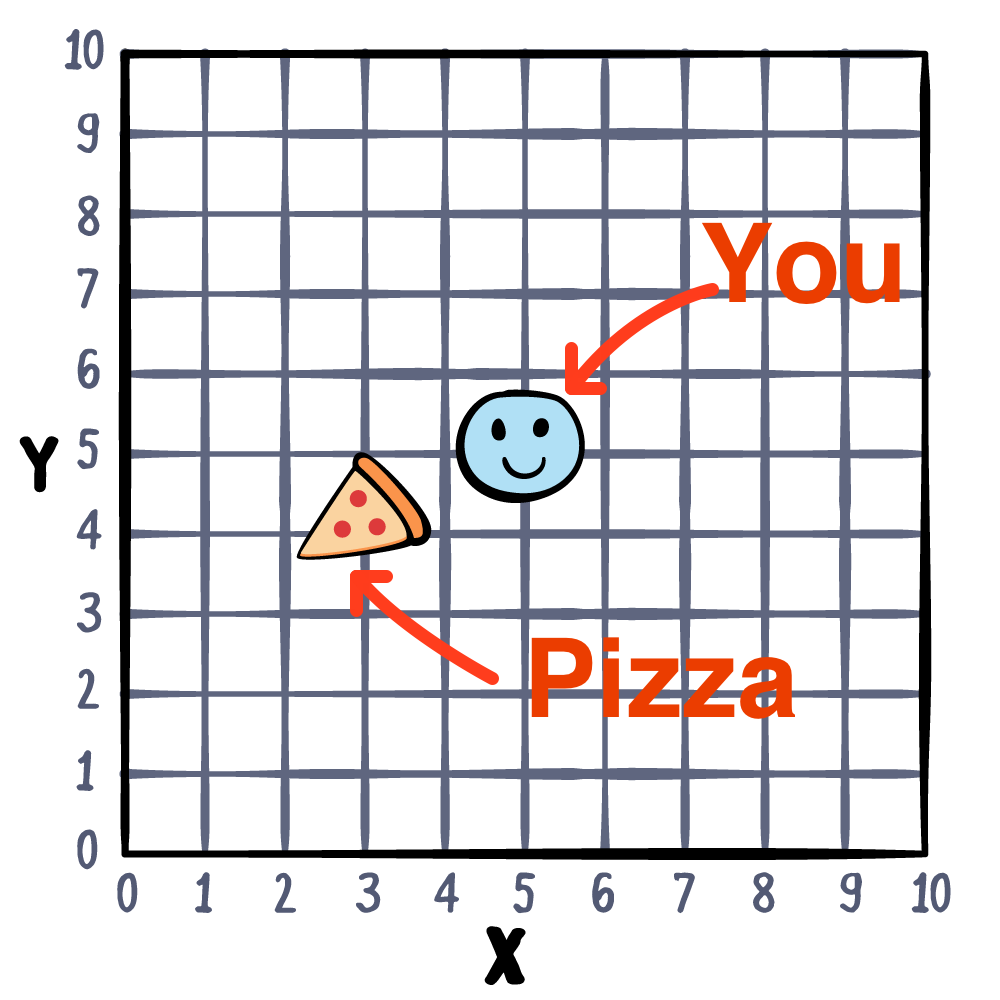

# 10 Stuructures

Swift에서 배우는 첫 `named-type` Sturucture에 대해서 배운다. `Int` , `String` , `Array` 이도 모두 Structue이다.

## Introducing structure

만일 Pizza가 피자의 위치에서 You까지 배달가능한지 알아내는 프로그램을 

작성한다고 해보자.



레스토랑의 위치를 튜플로나타내고 거리를 계산하는 함수와 해당위치가 레스토랑의 배달범위에 들어오는지 함수를 구성해낼수 있다.

```swift

let restaurantLocation = (3, 4)
let restaurantRange = 2.5

// Pythagorean Theorem 📐🎓
func distance(from source: (x: Int, y: Int),
              to target: (x: Int, y: Int)) -> Double {
  let distanceX = Double(source.x - target.x)
  let distanceY = Double(source.y - target.y)
  return (distanceX * distanceX +
    distanceY * distanceY).squareRoot()
}

```

```swift
func isInDeliveryRange(location: (x: Int, y: Int)) -> Bool {
  let deliveryDistance = distance(from: location,
                                  to: restaurantLocation)
  return deliveryDistance < restaurantRange
}

isInDeliveryRange(location: (x: 5, y: 5))

```

만일 레스토랑의 지점이 생겨 확인해줘야하는 위치가 늘어나면 프로그램이 어떻게 될까? inInDelvery함수에서 새로생긴 레스토랑의 위치를 추가로 확인해주면 될것이다. 

```swift
let restaurantLocation = (3, 4)
let restaurantRange = 2.5

let otherRestaurantLocation = (7, 8)
let otherRestaurantRange = 1.5

// Pythagorean Theorem 📐🎓
func distance(from source: (x: Int, y: Int),
              to target: (x: Int, y: Int)) -> Double {
  let distanceX = Double(source.x - target.x)
  let distanceY = Double(source.y - target.y)
  return (distanceX * distanceX +
    distanceY * distanceY).squareRoot()
}

func isInDeliveryRange(location: (x: Int, y: Int)) -> Bool {
  let deliveryDistance =
    distance(from: location, to: restaurantLocation)

  let secondDeliveryDistance =
    distance(from: location, to: otherRestaurantLocation)

  return deliveryDistance < restaurantRange ||
    secondDeliveryDistance < otherRestaurantRange
}

isInDeliveryRange(location: (x: 5, y: 5))

```

하지만 이런 배달위치가 10개가 되면? 그때는 어떻게 할까 또 함수에 추가하는 방식으로 해결해야 할까? 이렇게해서는 유지관리가 어려울것이다. 그래서 등장하는게 `Structure`이다.

### Your first structure

`struct` 키워드로 생성할수 있는 스트럭트는 이름을 가지는 내가 지정할수 있는 새로운타입이다. 

```swift
struct Location {
  let x: Int
  let y: Int
}

```

이 { } 사이에 있는것들을 struct의 멤버라고 하며 타입 내에 선언된 변수나 상수를 `properties` 라고 한다.

Location 타입의 값을 만들기위해서는 parameter list를 이용해서 초기화할수 있으며 이를 `initializer` 라고 한다.

```swift
let storeLocation = Location(x: 3, y: 4)
```

또한 모든 타입의 프로퍼티는 생성자를 통해 사용전에 초기화되어야한다.

struct를 이용해서 배달장소, 레스토랑을 아래처럼 표현할수도 있다.

```swift
struct DeliveryArea {
  let center: Location
  var radius: Double
}

var storeArea = DeliveryArea(center: storeLocation, radius: 2.5)

```

물론 위에서 보이는것처럼 만든 Struct는 다른 Struct의 프로퍼티가 될수도 있다.

## Accessing members

`dot syntax` 를 이용하면 Struct value내의 프로퍼티에 접근할수 있다. 여태까지 Strings, Arrays, Dictionaries에 했던것을 생각하면 똑같다.

```swift
print(storeArea.radius) // 2.5
print(storeArea.center.x) // 3
storeArea.radius = 250
```

물론 할당도 가능하다.  다만 이경우에는내부 프로퍼티를 variable로 선언해야되며 Struct내부의 값이 바뀌므로 Struct자체도 variable로 선언해야한다.

```swift
let fixedArea = DeliveryArea(center: storeLocation, radius: 4)

// Error: Cannot assign to property
fixedArea.radius = 250

```

위처럼 let으로 상수로 구조체를 만들면 접근이 불가능하다.

## Introducing methods

Struct를 활용해 아래처럼 함수를 새로 구성하룻 있다.

```swift
let areas = [
  DeliveryArea(center: Location(x: 3, y: 4), radius: 2.5),
  DeliveryArea(center: Location(x: 7, y: 8), radius: 1.5)
]

func isInDeliveryRange(_ location: Location) -> Bool {
  for area in areas {
    let distanceToStore =
      distance(from: (area.center.x, area.center.y),
                 to: (location.x, location.y))

    if distanceToStore < area.radius {
      return true
    }
  }
  return false
}

let customerLocation1 = Location(x: 8, y: 1)
let customerLocation2 = Location(x: 5, y: 5)

print(isInDeliveryRange(customerLocation1)) // false
print(isInDeliveryRange(customerLocation2)) // true

```

배달거리에 속하는지는 사실 특정레스토랑에 궁금한점이므로` DeliveryArea`자체가 이에 대해 알려줄수 있으면 좋을것 같은데...

Structer는 상수와 변수를 멤버로 가진것처럼 함수도 멤버로 가질수 있다. 이를 `methods` 라고 한다.

Stuct에 아래와 같은 코드를 추갛라수 있다.

```swift
func contains(_ location: Location) -> Bool {
  let distanceFromCenter =
    distance(from: (center.x, center.y),
               to: (location.x, location.y))

  return distanceFromCenter < radius
}

```

다른 구조체의 멤버처럼 메서드또한 dot syntax로 접근가능하다.

```swift
let area = DeliveryArea(center: Location(x: 3, y: 4), radius: 2.5)
let customerLocation = Location(x: 5, y: 5)
area.contains(customerLocation) // true

```

## Structure as values

`value` 는 Swfit의 structure에서 큰의미를 가지는데 스위프트에서 Structure는 value 타입이기 떄문이다. 

value type은 할당시에 인스턴스가 카피되는 타입을 뜻한다

```swift
var a = 5
var b = a
print(a) // 5
print(b) // 5

a = 10
print(a) // 10
print(b) // 5

```

이경우 a의 내용이 b에 복사되기 때문에 b의 변경은 a에 대해 아무런 영향을 주지 못한다. 이걸 ``copy-on-assginment` 라고 하고 이런 이유에서 `=` 키워드를 "is equal to" 가 아닌 "assgin" 으로 해석하는게 맞다.

같은 원칙이 `DeliveryArea` struct에도 적용된다.

```swift
var area1 = DeliveryArea(center: Location(x: 3, y: 4), radius: 2.5)
var area2 = area1
print(area1.radius) // 2.5
print(area2.radius) // 2.5

area1.radius = 4
print(area1.radius) // 4.0
print(area2.radius) // 2.5

```

똑같이 radius프로퍼티를 변경하더라도 이변경은 area2에 영향을 끼치지 않는다. 이런 disconnection이 structrure의 `value semantics` 를 잘나타낸다. 따라서 스트럭트는 안전하다. 다른 코드에의해서 값이 변경될 걱정은 안해도된다!

## Structure everywhere

방금 `Int` 와 `Location` struct가 어떻게 copy-on-assingment를 하는지 확인했다. 짐작했던듯이 Int타입도 Struct이다. 물론 `Double`, `String`, `Bool`, `Array`, `Dictionary` 도 스트럭쳐이다.

```swift
@frozen public struct Int : FixedWidthInteger, SignedInteger {
 // …
}

```

## Conforming to a protocol

방금 위의 예제에서 뭔가 칙숙하지 않은 `FixedWidthInteger`, `SignedIneger` 를 찾을수 있는데 이는 프로토콜로 `:` 뒤에 작성되서 이런경우 Int가 위 두프로토콜을 따른다고 할수 있다.

```swift
@frozen public struct Int : FixedWidthInteger, SignedInteger {
  // …
}

```

프로토콜은 타입이 반드시 지켜야하는 constraints의 집합이라고 할수있다.

다른 프로토콜의 간단한 예제를 보면 스탠다드 라이브러리의 `CustomStringConvertible` 이 있다.

```swift
public protocol CustomStringConvertible {
  /// A textual representation of this instance.
  var description: String { get }
}

```

이 프로토콜은 오로지 하나의 프로퍼티 requirement를 가지며 이경우 `description` 이다.

DeliveryArea가 해당 프로토콜을 따르게한후 아래 computed property를 추가하면

```swift
struct DeliveryArea: CustomStringConvertible {
  let center: Location
  var radius: Double
  var description: String {
    """
    Area with center: (x: \(center.x), y: \(center.y)),
    radius: \(radius)
    """
  }

  func contains(_ location: Location) -> Bool {
    distance(from: center, to: location) < radius
  }

  func overlaps(with area: DeliveryArea) -> Bool {
    distance(from: center, to: area.center) <=
    (radius + area.radius)
  }
}

```

해당 Struct를 프린트하면 description의 내용을 얻을수 있다.

```swift
print(area1) // Area with center: (x: 3, y: 4), radius: 4.0
print(area2) // Area with center: (x: 3, y: 4), radius: 2.5

```

해당 프로토콜을 따르는 타입들은 반드시 decription이란 프로퍼티를 가지고 이점을 print 함수가 이용해 위처럼 출력을 해줄수 있는것이다. 

어떤 named type도 이런 프로콜을 이용할수 있으며 Ch16에서는 이런 프로토콜을 정의하는 법을 배울거다.

## **Key points**

- Structures are named types you can define and use in your code.
- Structures are **value types**, which means their values are copied on assignment.
- You use dot syntax to access the members of named types such as structures.
- Named types can have their own variables and functions, which are called properties and methods.
- Conforming to a protocol requires implementing the properties and methods required by that protocol.
