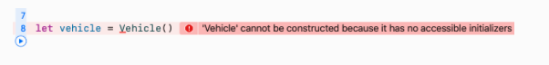

# 16. Protocols
다른 타입들과 달리, 프로토콜에서는 실제 구현이 아닌 interface, blueprint만 제공이 된다. 그리고 실제 타입(struct, classes, enumeration)에서 이 프로토콜을 **채택**한다.

## Introducing protocols
```swift
protocol Vehicle{
	func accelerate()
	func stop()
}
```
키워드 protocol 다음에 프로토콜 이름, 그리고 중괄호 내부에 프로토콜 멤버를 작성한다.
**프로토콜에서는 어떤 구현도 포함하지 않는다.**
이 말의 의미는 직접적으로 Vehicle의 instance를 생성하지 않는다는 말이다.   


### Protocol syntax
프로토콜은 class, struct, enum에 의해 채택될 수 있다. 프로토콜을 채택한 types은 protocol에 선언되어 있는 멤버(Requirement)들을 모두 구현해야 한다.

```swift
class Unicycle: Vehicle{
	var pedding = false
	func accelerate(){
		pedding = true
	}
	
	func stop(){
		pedding = false
	}
}
```
우선 프로토콜의 이름을 타입이름 콜롬(:) 다음에 작성한다. (다른 클래스를 상속하는 문법이랑 비슷하다.)

위의 코드에서는 Unicycle은 Vehicle 프로토콜을 채택, 채용한다.
Structs, enumerations도 위와 같은 문법으로 프로토콜을 채택할 수 있다.

클래스가 다른 클래스를 상속받고 있고, 프로토콜을 채용하고 있으면 항상 superclass의 이름을 먼저 작성한다.

만약 Unicycle 클래스에서 stop()의 구현을 삭제하면, Swift는 Unicycle이 Vehicle 프로토콜을 완전히 채택하지 않았다라는 에러가 발생한다.


### Methods in protocols
Vehicle 프로토콜에서 두 개의 메소드를 정의했다. 이것들은 프로토콜을 채택한 타입들이 무조건 구현을 해야 한다.
메소드는 앞에서 구현한 것처럼 파라미터나 리턴 값도 가질 수 있다.

```swift
enum Direction{
	case left
	case right
}

protocol DirectionalVehicle{
	func accelerate()
	func stop()
	func turn(_ direction: Direction)
	func description() -> String
}
```
메소드 또한 구현은 하면 안되고 정의만 해야 한다. 또한 프로토콜은 구현에 대해서는 어떠한 강제도 하지 않는다.

### Properties in protocols
protocol에서 프로퍼티도 정의할 수 있다.
```swift
protocol VehicleProperties {
	var weight: Int { get }
	var name: String { get }
}
```
프로토콜에서 프로퍼티를 정의할 때, get으로 할 것인지, get, set으로 할 것인지를 명확하게 지정해주어야 한다.
또한 프로토콜에서는 무조건 var로. 선언을 해주어야하는데, 가변성과는 관계가 없고 선언하는 멤버가 property라는 것을 알려주기 위해서 사용하는 것이다.

프로퍼티 또한 구현은 하면 안되고, 정의만 해주어야 한다.

get, set 구현에서도 알 수 있듯이, 프로토콜은 프로퍼티의 구현에 대해서는 관여를 하지 않는다. 이것은 프로퍼티의 storage에 대해서는 알지 못한다는 것도 의미한다.

우리는 이 프로퍼티를 computed properties 나 일반적인 variables로 사용할 수 있다.

> 프로퍼티가 get만 선언되어도, stored property로 구현하거나, read-write computed property로 사용할 수 있다. 요구사항은 말그대로 최소한으로 지켜야하는 요구사항이라, 그 이상을 해도 상관없다.  


### Initializers in protocols
protocol자체는 생성자를 못만들어도 생성자를 정의할 수는 있다.
```swift
protocol Account{
	var value: Double { get }
	init(initialAmount: Double)
	init?(transferAccount: Account)
}
```
Account프로토콜에서, 두 개의 생성자를 정의한다.
Account를 채택한 타입들은 이 생성자를 구현해야 한다.
만약 class 가 이 프로토콜을 채택하면 무조건 required initializers로 생성자를 구현해야 한다.
(해당 프로토콜을 상속받는 모든 Subclass에서 프로토콜의 요구사항을 충족해야 하므로)
> required: 생성자 앞에 required 키워드가 붙으면 해당 클래스를 상속받는 subclass에서 동일한 initializer를 직접 구현해야 한다.  
>   
```swift
class BitcoinAccount: Account{
	var value: Double
	required init(initialAmount: Double){
		value = initialAmount
	}
	required init?(transferAccount: Account) {
    guard transferAccount.value > 0.0 else {
      return nil
    }
    value = transferAccount.value
  }
}
```


### Protocol inheritance
Vehicle 프로토콜은 자전거, 차, 스노모빌, 심지어는 비행기같은 모든 차량에 적용될 수 있는 메소드를 포함한다.


만약 Vehicle과 관련된 모든 것들을 포함하는 프로토콜을 정의하기를 원한다면 (바퀴 같은), 다른 클래스를 상속하는 것처럼 프로토콜을 상속한다.
```swift
protocol WheeledVehicle: Vehicle{
	var numberOfWheels: Int { get }
	var wheelSize: Double { get set }
}
``` 
이제, WheeledVehicle 프로토콜을 채택하는 타입(class 등)은 Vehicle의 모든 멤버들과 WheeledVehicle의 모든 멤버들을 포함한다.
```swift
protocol Vehicle{
    func accelerate()
    func stop()
}

protocol WheeledVehicle: Vehicle {
  var numberOfWheels: Int { get }
  var wheelSize: Double { get set }
}

class Car: WheeledVehicle{
    var numberOfWheels: Int = 4
    
    var wheelSize: Double = 20
    
    func accelerate() {
        
    }
    
    func stop() {
        
    } 
}
```
Subclassing 처럼, WheeledVehicle을 채용하는 어떤 타입은 Vehicle 프로토콜과 **is** 관계를 가질 것이다.
> is : 특정 타입이 프로토콜을 채용하는지를 보는 척도  
> instance is ProtocolName => 타입이 프로토콜을 채용하고 있는지 확인할 때 사용  
> let c = Car()  
> c is WheeledVehicle // true  


## Implementing protocols
```swift
class Bike: Vehicle{
	var peddling = false
	var brakesApplied = false
	
	func accelerate() {
		peddling = true
		brakesApplied = false
	}
	func stop(){
		peddling = false
		brakesApplied = true	
	}
}
```
Bike 클래스는 Vehicle의 모든 메소드들을 구현한다. 만약 accelerate()나 stop()이 정의되지 않으면, error가 발생할 것이다.

### Implementing protocols
프로토콜의 프로퍼티는 get으로 선언되고, set으로 선언될 수도 있다. 프로토콜을 채택한 타입은 최소한으로 요구사항을 구현해야 한다. (프로토콜에는 get으로 되어 있어도, 타입에서는 get-set으로 구현 가능하다는 말)


```swift
class Bike: WheeledVehicle{
	let numberOfWheels = 2
	var wheelSize = 16.0

	var peddling = false
	var brakesApplied = false

	func accelerate() {
		peddling = true
		brakesApplied = false
	}
	func stop(){
		peddling = false
		brakesApplied = true	
	}
}
```
numberOfWheels 상수는 get 요구사항을 충족시킨다. wheelSize 변수는 get, set 요구사항 둘 다 충족 시킨다.

프로토콜은 요구사항을 어떻게 구현하는 지에 대해서는 관여하지 않는다.
get 요구사항에 대해 우리가 할 수 있는 선택은 다음과 같다.
* constant stored property
* variable stored property
* read-only computed property
* read-write computed property

### Associated types in protocols
프로토콜 멤버로 associated type을 추가할 수도 있다. 프로토콜에서 associated type을 사용할 때, 어떤 타입인지를 명시하는 것이 아니라, 그냥 해당 장소에 타입이 있다 정도로만 언급한다.
```swift
protocol WeightCalculatable{
	associatedtype WeightType
	var weight: WeightType { get }
}
```
weight 의 타입에 대한 결정은 구현할 때 지정한다.
```swift
class HeavyThing: WeightCalculatable {
  // This heavy thing only needs integer accuracy
  typealias WeightType = Int

  var weight: Int { 100 }
}

class LightThing: WeightCalculatable {
  // This light thing needs decimal places
  typealias WeightType = Double

  var weight: Double { 0.0025 }
}
```
typealias를 이용해서 WeightType이 무슨 타입을 의미하는지를 명시한다.
이것은 필수는 아니고, 컴파일러가 타입을 추론할 수 있어서 생략할 수도 있다.


### Implementing multiple protocols
클래스는 하나의 클래스만 상속받을 수 있다. 반대로 클래스(struct, enum) 은 아주 많은 프로토콜을 채택할 수 있다. 


```swift
protocol Wheeled {
  var numberOfWheels: Int { get }
  var wheelSize: Double { get set }
}

class Bike: Vehicle, Wheeled {
  // Implement both Vehicle and Wheeled
}
```
프로토콜은 여러 개 채택할 수 있다. 위의 예시에서도 Bike 클래스는 Vehicle, Wheeled 프로토콜에 있는 모든 멤버를 구현해야 한다.

### Protocol composition
**protocol composition** 이란 두 개 이상의 프로토콜을 **&** 로 연결하면, 병합된 임시 프로토콜이 생성되는 것을 말한다.

예를 들어서, 만약 Vehicle 프로토콜의 stop() 함수와 Wheeled 프로토콜의 numberOfWheels 프로퍼티에 접근하는 함수를 생성한다고 해보자. 이때 & 을 이용한다.
```swift
func roundAndRound(transportation: Vehicle & Wheeled) {
    transportation.stop()
    print("The brakes are being applied to
          \(transportation.numberOfWheels) wheels.")
}

roundAndRound(transportation: Bike())
// The brakes are being applied to 2 wheels.
```

### Extensions & protocol conformance
extension을 이용해서 프로토콜을 채택할 수도 있다.
```swift
protocol Reflective {
  var typeName: String { get }
}

extension String: Reflective {
  var typeName: String {
    "I’m a String"
  }
}

let title = "Swift Apprentice!"
title.typeName // I’m a String
```
String에 custom protocol을 추가하였다.
String 은 기본으로 제공되는 라이브러리이지만 extension을 이용해서 원하는 프로토콜을 채택할 수 있도록 할 수 있다.

extension의 또 다른 장점은 필요한 메소드나 프로퍼티들을 하나의 그룹으로 만들어서 사용할 수 있다는 점이다. (Type definition에서 한번에 때려넣지 않아도 됨)

```swift
class AnotherBike: Wheeled {
  var peddling = false
  let numberOfWheels = 2
  var wheelSize = 16.0
}

extension AnotherBike: Vehicle {
  func accelerate() {
    peddling = true
  }
  
  func stop() {
    peddling = false
  }
}
```
extension에서는 accelerate와 stop을 묶었다. 만약 AnotherBike에서 Vehicle프로토콜을 제거하고 싶다면, 그냥 extension을 지우기만 하면 된다.

> extensions에서는 stored property는 선언할 수 없다.   


### Requiring reference semantics
Protocol은 value type(structs and enum), reference type(classes) 에서 채택될 수 있다. 그렇다면 protocols은 value나 reference의 의미를 가질까?
정답은 상황에 따라 다르다.! 이다. 아래의 예시를 보자.
```swift
protocol Named {
  var name: String { get set }
}

class ClassyName: Named {
  var name: String
  init(name: String) {
    self.name = name
  }
}

struct StructyName: Named {
  var name: String
}
```
만약 Named 프로토콜을 채용하고 있는 ClassyName의 인스턴스를 Named 타입으로 지정을 했다면, reference 의 형태를 가지는 것을 볼 수 있다.
```swift
var named: Named = ClassyName(name: "Classy")
var copy = named

named.name = "Still Classy"
named.name // Still Classy
copy.name // Still Classy
```
또, 만약 value type의 인스턴스를 할당 했다면, value 의 형태를 가지는 것을 볼 수 있다.
```swift
named = StructyName(name: "Structy")
copy = named

named.name = "Still Structy?"
named.name // Still Structy?
copy.name // Structy
```
위와 같은 상황은 항상 명확한것은 아니다. Swift는 reference보다 value를 더 선호한다. 
만약 클래스에 의해서만 채택되는 프로토콜을 만들려고 한다면, 아래와 같이 해당 프로토콜이 AnyObject 프로토콜을 채택하도록 하여서, Swift가 해당 프로토콜을 value type이 아니라 reference type으로만 사용하도록 해야 한다.
```swift
protocol Named: AnyObject {
  var name: String { get set }
}
``` 


## Protocols in the Standard Library
Swift standard library는 굉장히 많은 방식으로 프로토콜을 사용한다.

### Equatable
아래는 단순히 == operator로 두 개의 정수를 비교하는 코드이다.
```swift
let a = 5
let b = 5
a == b // true
```
이것을 String에도 똑같이 적용할 수 있다.
```swift
let swiftA = "Swift"
let swiftB = "Swift"
swiftA == swiftB // true 
```
하지만 == 을 모든 타입에서 사용할 수 있는 것은 아니다. 
한 팀의 기록을 보여주고, 두 개의 기록이 같은지를 판단하는 클래스를 작성한다고 해보자.
```swift
class Record {
  
  var wins: Int
  var losses: Int
    
  init(wins: Int, losses: Int) {
      self.wins = wins
      self.losses = losses
  }
}

let recordA = Record(wins: 10, losses: 5)
let recordB = Record(wins: 10, losses: 5)

recordA == recordB // Build error!
```
== operator은 클래스에는 적용할 수 없다. 하지만 == 을 단순히 String 이나 Int에서만 사용할 수 있다고 생각하면 안된다. 추가로 코드를 작성해서 == 연산자의 사용을 확대시킬 수도 있다. 

Int와 String 은 Equatable 이라는 프로토콜을 채택한다.
```swift
protocol Equatable {
  static func ==(lhs: Self, rhs: Self) -> Bool
}
```
우리는 이것을 Record에서도 채택할 수 있도록 해보자.
```swift
extension Record: Equatable {
  static func ==(lhs: Record, rhs: Record) -> Bool {
    lhs.wins == rhs.wins &&
    lhs.losses == rhs.losses
  }
}
```
Equatable 프로토콜의 == 연산자를 새롭게 구현하여서, 두 개의 Record instance가 동일한지를 판단하도록 하였다. 

이제 우리는 recordA == recordB 가 true인 것을 알 수 있다.


### Comparable
Comparable은 Equatable의 subprotocol이다.
```swift
protocol Comparable: Equatable {
  static func <(lhs: Self, rhs: Self) -> Bool
  static func <=(lhs: Self, rhs: Self) -> Bool
  static func >=(lhs: Self, rhs: Self) -> Bool
  static func >(lhs: Self, rhs: Self) -> Bool
}
```
아래의 코드에서는 Record 클래스가 Comparable을 채택하여 < 연산자를 다시 구현하였다.
```swift
extension Record: Comparable {
  static func <(lhs: Record, rhs: Record) -> Bool {
    if lhs.wins == rhs.wins {
      return lhs.losses > rhs.losses
    }
    return lhs.wins < rhs.wins
  }
}
```


### “Free” functions
Equatable, Comparable을 채택하는 타입에 대해 Swift library는 아주 많은 “free” functions와 methods를 제공한다.

Comparable 타입을 포함하는 collection(Array 같은)에 대해서, sort()와 같은 메소드에 “무료로” 접근할 수도 있다.
```swift
let teamA = Record(wins: 14, losses: 11)
let teamB = Record(wins: 23, losses: 8)
let teamC = Record(wins: 23, losses: 9)
var leagueRecords = [teamA, teamB, teamC]

leagueRecords.sort()
// {wins 14, losses 11}
// {wins 23, losses 9}
// {wins 23, losses 8}
```
위에서 Record 클래스에 두 개의 값을 비교하는 능력을 줬기 때문에, Records 배열을 정렬하기 위해 필요한 정보들은 모두 가지고 있다. 또한 아래와 같이 Comparable, Equatable이 제공하는 도구들도 모두 제공받는다. 
```swift
leagueRecords.max() // {wins 23, losses 8}
leagueRecords.min() // {wins 14, losses 11}
leagueRecords.starts(with: [teamA, teamC]) // true
leagueRecords.contains(teamA) // true
```


### Other useful protocols
### Hashable
Hashable 프로토콜은 Equatable 의 subprotocol이다.
Value type(struct, enum)에 대해서, 컴파일러는 자동으로 Equatable, Hashable 을 채택하도록 한다. 하지만 reference(class) type에 대해서는 우리가 추가해야 한다.
```swift
class Student {
  let email: String
  let firstName: String
  let lastName: String

  init(email: String, firstName: String, lastName: String) {
    self.email = email
    self.firstName = firstName
    self.lastName = lastName
  }
}

extension Student: Hashable {
  static func ==(lhs: Student, rhs: Student) -> Bool {
    lhs.email == rhs.email &&
    lhs.firstName == rhs.firstName &&
    lhs.lastName == rhs.lastName
  }

  func hash(into hasher: inout Hasher) {
    hasher.combine(email)
    hasher.combine(firstName)
    hasher.combine(lastName)
  }
}
```
Class는 struct, enum과는 달리 Hashable을 채용해도 필요한 메소드를 자동으로 제공해주지 않는다. 따라서 우리가 직접 구현해야 한다.
실제 Hashable은 Equatable을 채용하고 있기 때문에, Equatable의 연산자인 ==과 Hashable의 메소드인 hash를 직접 구현해 주어야 한다.

hash 메소드를 보자. 실제로 hash 함수를 직접 구현하는 것은 매우 어렵다. 이 부분에 대해서는 다행히 Hasher에서 알아서 해준다. 우리는 Hasher가 제공하는 combine 메소드만 이용해서 Hash에 포함시킬 프로퍼티만 전달해주기만 하면 된다.

combine으로 값을 전달하는 경우에는, 항상 동일한 순서로 전달해야 하고, 모든 stored property를 전달해야 한다. combine으로 전달하는 타입은 무조건 Hashable을 구현해야 한다.

```swift
let john = Student(email: "johnny.appleseed@apple.com",
                   firstName: "Johnny",
                   lastName: "Appleseed")
let lockerMap = [john: "14B"]
```
Student 클래스에서 Hashable을 구현했으니, Dictionary의 key 값으로 사용할 수 있게 되었다.


### Identifiable
Identifiable 프로토콜은 id 라는 독특한 프로퍼티를 제공한다.
Identifiabled은 id라는 이름의 get property를 요구하고, 해당 타입은 무조건 Hashable이어야 한다.
```swift
extension Student: Identifiable{
	var id: String{
		email
	}
}
```
Student는 Hashable 프로토콜을 채택했기 때문에 Identifiable 프로토콜을 채택할 수 있다. 
여기서 email이 각 student에 대해서 unique하기 때문에 id 값으로 사용할 수 있다.


### CustomStringConvertible
CustomStringConvertible 프로토콜은 인스턴스 로그를 기록하거나, 디버깅을 도와준다.
만약 John 인스턴스를 print() 로 호출하면, Swift는 대충 타입만 출력한다.
```swift
print(john)
// Student
```
여기서 CustomStringConvertible 프로토콜은 딱 한가지 description 프로퍼티 요구사항만을 가지고 있다. 우리는 이것을 이용해서 print()를 할 때, 출력되는 방식을 지정할 수 있다.
```swift
protocol CustomStringConvertible {
  var description: String { get }
}
```
CustomStringConvertible을 채용해서, 다음과 같이 지정한다.
```swift
extension Student: CustomStringConvertible {
  var description: String {
    "\(firstName) \(lastName)"
  }
}
print(john)
// Johnny Appleseed
```

CustomDebugStringConvertible도 CustomStringConvertible과 유사하다.
이것도 debugDescription 프로퍼티를 사용해서 다시 재정의 할 수 있다.
<br/>
<br/>
<br/>

## Key points
* 프로토콜은 클래스, 구조체, 열거형들이 채용할 수 있는 계약를 정의한다.
* 프로토콜을 채용한 타입은 프로토콜의 모든 멤버들을 구현해야 한다.
* 타입은 여러 개의 프로토콜을 채택할 수 있다.
* extension을 이용해서 따로 프로토콜을 채용하는 것도 가능하다.
* Swift standard library는 프로토콜을 굉장히 많이 사용한다. (Equatable, Hashable 같은)


