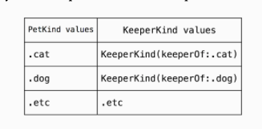
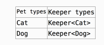

# 17. Generics
> 우리는 Swift array를 사용할 때마다 generics를 사용했다. 


## Introducing generics
### Values defined by other values
개와 고양이만 판매하는 펫샾을 운영한다고 가정해보자. PetKind라는 이름의 타입을 정의하고, 이것은 두가지 값(cat, dog)을 가질 수 있다. 
```swift
enum PetKind{
	case cat
	case dog
}
```
Pet keepers는 오직 고양이만 키우거나 개만 키우도록 하자.
```swift
struct KeeperKind{
	var keeperOf: PetKind
}
```
그리고 나서 catKeeper와 dogKeeper를 생성해보자.!
```swift
let catKeeper = KeeperKind(keeperOf: .cat)
let dogKeeper = KeeperKind(keeperOf: .dog)
```
여기서 가게를 어떻게 모델링할 것인지에 대해 명시해야 할 두가지가 있다.
1. Pet 과 keeper의 타입의 값을 달리 함으로써, pet과 keeper가 다른 종류라는 것을 표현한다. Pet 종류는 PetKind라는 하나의 타입이 있고, keeper는 KeeperKind라는 하나의 타입이 있다. 
pet의 종류는 PetKind 타입의 다른 값으로 표현한다. (Cat, dog) 
마찬가지로 keeper의 종류도 KeeperKind 타입의 다른 값으로 표현한다.
2. 만약 새를 추가로 판매하기 시작했다면, PetKind에 .bird만 추가한다. 이렇게 되면, bird keeper도 새로 추가할 수 있게 된다.
수백 개의 pet을 추가하면, 동시에 수백 명의 keeper가 추가될 수 있다.


KeeperKind 대신에 새로운 enum을 추가해도록 하자.
```swift
enum EnumKeeperKind{
	case catKeeper
	case dogKeeper
}
```
위와 같이 enum으로 keeper를 관리하도록 해보자. 만약 PetKind.snake를 새롭게 추가했는데 EnumKeeperKind.snakeKeeper를 추가하는 것을 잊었다면, 아주 최악의 상황이 생길 것이다.

위와 같은 상황이 일어나도록 하지 않기 위해서 KeeperKind와 같이 PetKind의 프로퍼티를 가지고 관계를 명확하게 해준다.
PetKind에 값이 추가되거나 제거되면 동시에 KeeperKind의 값도 추가되거나 제거될 수 있도록 한다.   


## Anatomy of generic types
Generics는 실제 자료형(Int, String 등등)을 대체하는 **placeholder** 의 의미를 가진다.
아래와 같이 keeper에 대한 **generic type** 을 정의할 수 있다.
```swift
class Keeper<Animal>{}
```
Animal을 **Type parameter**라고 하며, 문맥에 따라서 실제 타입으로 대체된다.   


사진에서처럼 Pet type이 Cat인 경우에는 Animal이 Cat타입으로 바뀌고, Pet type이 Dog 인 경우에는 Animal이 Dog 타입으로 바뀐다. 

```swift
var aCatKeeper = Keeper<Cat>()
```
실제 인스턴스를 생성할때, Keeper의 타입을 명시해주어야 한다.
```swift
var aKeeper = Keeper()
```
컴파일러는 Keeper가 어떤 타입인지 알 수 없기 때문에 compile error 가 발생한다.
Keeper<Cat> 처럼 명확하게 타입을 제공하면, Keeper는 Cat이라는 **concrete types** 를 가지게 된다.


### Using type parameters
Cat 클래스와 Dog 클래스에 이름을 추가해보자.
```swift
class Cat {
  var name: String

  init(name: String) {
    self.name = name
  }
}

class Dog {
  var name: String

  init(name: String) {
    self.name = name
  }
}

class Keeper<Animal> {
  var name: String

  init(name: String) {
    self.name = name
  }
}
```
keeper가 동물들을 기른다고 해보자. 모든 keeper는 아침에 한마리, 저녁에 한마리를 기른다. 우리는 아침 동물, 저녁 동물에 대한 프로퍼티들을 추가할 수 있다.
이 프로퍼티들은 어떤 타입을 가져야 할까?

위에서 언급한대로, keeper는 개만 키우거나, 고양이만 키울 수 있다.
그렇다면, 아침에 관리하는 동물과 저녁에 관리한느 동물의 타입이 같아야 한다.
```swift
class Keeper<Animal> {
  var name: String
  var morningCare: Animal
  var afternoonCare: Animal

  init(name: String, morningCare: Animal, afternoonCare: Animal) {
    self.name = name
    self.morningCare = morningCare
    self.afternoonCare = afternoonCare
  }
}
```
이것을 표현하기 위해서 type parameter를 사용한다. 코드에서 보면, generic type definition에 Animal을 사용해서 아침 동물, 저녁 동물에 같은 타입의 동물이 올 수 있도록 한다. 

함수 파라미터를 함수 내부에서 상수로 사용할 수 있는것과 같이, 타입 파라미터(Animal 같은) 또한 타입 내부에서 사용할 수 있다.
타입 파라미터는 Keeper<Animal> 의 stored properties, computed properties, method signatures, nested type 등등에서 사용될 수 있다.

아래는 Keeper에 대한 인스턴스를 생성한다. Swift는 컴파일 타임에 morning 과 afternoon 타입이 같다는 것을 안다.
```swift
let jason = Keeper(name: "Jason",
                   morningCare: Cat(name: "Whiskers"),
                   afternoonCare: Cat(name: "Sleepy"))
```
Keeper jason은 아침에 고양이 Whiskers를 관리하고, 저녁에 고양이 Sleepy를 관리한다. jason의 타입은 Keeper<Cat>이다. 또한 Keeper<Cat>(…)을 하지 않아도 Swift는  argument 값을 이용해서 자동으로 타입을 추론한다.

### Type constraints
func feed(cat: Cat) { } 함수를 생각해보자. 우리는 파라미터의 값을 넘길때, 아무 타입이나 넘길 수 없다. Cat 타입의 값만 넘길 수 있다.

하지만, type parameter를 생각했을 때, Animal은 어떤 타입도 올 수가 있다. 심지어는 동물과 관련되지 않은 Int, String 타입도 올 수 있다.

내가 원하는 특정 타입만 오도록 하고 싶을 때, Swift는 **type constraints** 를 제공한다.

```swift
class Keeper<Animal: Pet> {
   /* definition body as before */
}
```
: Pet을 사용하면, 만약에 Pet이 클래스인 경우에는 Animal에 무조건 Pet의 subclass만 오도록 하고, Pet이 프로토콜인 경우에는 Pet 프로토콜의 요구사항을 구현해야 한다.

만약 위와 같이 Pet인 경우만 오도록 한다면, Cat, Dog클래스는 모두 Pet 클래스를 subclassing 하거나, Pet 프로토콜을 채택해야만 한다.
```swift
protocol Pet { 
  var name: String { get }  // all pets respond to a name
}
extension Cat: Pet {}
extension Dog: Pet {}
```

위와 같은 방법 말고도, *generic where clause* 를 이용해서 더 복잡한 type constraints를 추가할 수도 있다.
예를 들어, meow() 메소드를 지원하는 Cat arrays를 원한다고 해보자.
extension을 이용해서 배열의 Element가 Cat일때, array가 meow() 메소드를 제공하도록 하자.
```swift
extension Array where Element: Cat {
  func meow() {
    forEach { print("\($0.name) says meow!") }
  }
}
```
또한, 타입이 어떤 프로토콜을 무조건 채용해야한다고 할 수도 있다.
meow라고 울 수 있는 것을 Meowable이라고 해보자. 
```swift
protocol Meowable {
  func meow()
}

extension Cat: Meowable { 
  func meow() {
    print("\(self.name) says meow!")
  }
}

extension Array: Meowable where Element: Meowable {
  func meow() {
    forEach { $0.meow() }
  }
}
```
elements가 Meowable이면, 모든 배열은 Meowable 프로토콜을 따른다.
위의 코드를 **conditional conformance** 라고 한다.

## Arrays
Array도 가장 흔한 generic type 중 하나이다. 
Array 또한 다양한 형식을 처리할 수 있도록 generic으로 구현되어 있다. 만약 Int로 선언하면, 컴파일러가 Int를 처리하는 코드를 자동으로 생성해준다.
```swift
let animalAges: [Int] = [2,5,7,9]
```
Array<Int> 대신에, [Int]를 대신해서 사용할 수도 있다.
```swift
let animalAges: Array<Int> = [2,5,7,9]
```
이 코드는 바로 위의 코드와 의미가 같다.
Array<Element>와 [Element]는 바꿀 수 있다. 따라서, 생성자를 만들 때, Array<Int>() 대신에 [Int]()을 작성해도 된다.

## Dictionaries
Dictionary는 콤마로 구분된 두 개의 타입 파라미터를 가진다. 
```swift
struct Dictionary<Key: Hashable, Value> // etc..
```
Key와 Value는 각각 dictionary의 key와 valule의 타입을 나타낸다.
Key : Hashable에서 볼 수 있듯이, Key 값은 hashable이어야 하는 제약이 있다.

다수의 타입 파라미터를 가진 Dictionary같은 타입을 초기화할 때는 단순히 콤마로 구분지어 준다.
```swift
let intNames: Dictionary<Int, String> = [42: "forty-two"]
```
array처럼, dictionary도 shorthand notation을 가진다. [Key: Value]
```swift
let intNames2: [Int: String] = [42: "forty-two", 7: "seven"]
let intNames3 = [42: "forty-two", 7: "seven"]
```


## Optionals
Optional은 enumeration으로 표현할 수 있다.
```swift
enum Optional<Wrapped> {
  case none
  case some(Wrapped)
}

var birthdate: Optional<Date> = .none
if birthdate == .none {
  // no birthdate
} 
```
Optional로 표현할 수 있는 어떤 타입이든 표현할 수 있도록 generic을 이용한다.
```swift
var birthdate: Date? = nil
if birthdate == nil {
  // no birthdate
}
```
물론 위의 표현식처럼 일반적인 방식으로도 표현할 수 있다.


## Generic function parameters
함수 또한 generic될 수 있다. 함수의 **type parameter list** 가 함수 이름 바로 이후에 나오게 한다.
아래의 함수는 두 개의 arguments를 받고, 순서를 변경한다.
```swift
func swapped<T, U>(_ x: T, _ y: U) -> (U, T) {
	(y, x)
}

swapped(33, "Jay") // returns ("Jay", 33)
```
코드에서 보면, 타입 파라미터 <T, U> 의 generic parameter list, 함수 파라미터 리스트 (_ x: T, _ y: U) 가 있다.
일반적인 generic과 같이, T, U에는 어떤 타입이든 올 수 있다.


## Key points
* Generics은 Swift 어디에든 있다. Optional, arrays, dictionaries, other collection structures, +, == 같은 연산자에도!
* Generic은 type parameter를 통해 어떤 타입이든 올 수 있도록 할 수 있다.
* generic type은 compiler에 의해 compile-time에 생성된다.
* generic type은 실제 타입은 아니고, 새로운 타입을 정의하기 위한 템플릿으로 보면 된다.
* Swift는 **type constraints** 를 제공한다. 


 


