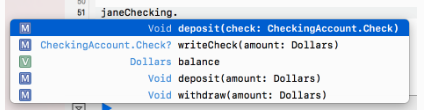
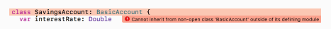
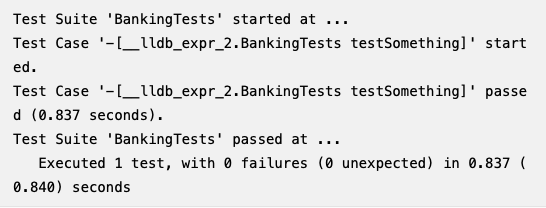

# 18. Access Control, Code Organization & Testing
현재까지 프로퍼티, 메소드, 생성자 등을 통해 Swift type을 선언했다.
이러한 요소들은 **interface** 를 구성하거나, **API(Application Programming Interface)** 를 구성한다.

코드가 복잡해짐에 따라, interface를 잘 관리하는것이 software design에서 중요한 부분이 되었다. 

“Helpers” 역할을 하는 메소드를 만들고 싶을 수도 있고, interface에서는 일어나지 않았으면 하는 내부 상태를 추적하는  프로퍼티를 만들고 싶을 수 있다.
Swift는 **access control** 으로 이러한 상황을 해결한다.
access control은 사용자에게 복잡한 구현은 보이지 않도록 할 수 있다.

이렇게 숨겨진 내부 구현은 거의 불변하다.  여기에 직접적으로 접근하는 것을 막고, 불변한 상태를 유지하는 것은 **encapsulation** 이라고 알려진 software design concept이다. 

이번 챕터에서는 access control을 배우고, 문제를 어떻게 해결하고 적용하는지를 볼 것이다.

## problems introduced by lack of access control
Banking library를 작성한다고 해보자. 이 library를 이용해서 고객(다른 은행)이 banking software를 작성한다고 해보자.
```swift
/// A protocol describing core functionality for an account
protocol Account {
  associatedtype Currency

  var balance: Currency { get }
  func deposit(amount: Currency)
  func withdraw(amount: Currency)
}
```
Account 프로토콜은 계좌가 가져야할 입금, 출금, 잔금에 대한 정보를 가지고 있다.
그리고 나서, Account를 채택하는 타입을 하나 생성해보자.
```swift
typealias Dollars = Double

/// A U.S. Dollar based "basic" account.
class BasicAccount: Account {

  var balance: Dollars = 0.0

  func deposit(amount: Dollars) {
    balance += amount
  }

  func withdraw(amount: Dollars) {
    if amount <= balance {
      balance -= amount
    } else {
      balance = 0
    }
  }
}
```
BasicAccount 클래스에서는 deposit(amount:) 와 withdraw(amount:) 메소드를 구현한다. (단순히 잔금에서 돈을 더하거나 뺀다)
여기서 주목할 점은 balance는 read-only이다. (프로토콜에서 get 으로 선언함). 하지만 실제로는 BasicAccount 는 balance를 read-write로 사용한다.

```swift
// Create a new account
let account = BasicAccount()

// Deposit and withdraw some money
account.deposit(amount: 10.00)
account.withdraw(amount: 5.00)

// ... or do evil things!
account.balance = 1000000.00
```
Account 프로토콜에서 read-only로 설정했지만, 이것은 최소한으로 지켜야 하는 요구사항이어서, 외부에서 balance값을 바꾸는 것도 가능하게 되었다. (이럼 안됨!)

여기서 access control이 balance를 사용할 수 있는 scope을 제한할 수 있다.


## Introducing access control
우리는 프로퍼티, 메소드, 또는 타입 선언 바로 앞에 modifier 키워드를 추가해서 access modifier를 추가할 수 있다.
여기서 access control modifier는 private(set)으로, balance의 setter를 private으로 지정한다는 의미이다. private의 의미로 알 수 있듯이, private(set)을 설정하면 해당 프로퍼티가 존재하는 scope내에서만 balance의 값을 변경할 수 있다.
(괄호 안에는 get/set modifier를 선택적으로 추가할 수 있다.)   


 **private** modifier는 여러 개의 access modifier 중 하나이다.
* **private**: 같은 source file내에서, 타입을 정의한 곳, 타입에 대한 extension, nested type에서만 접근할 수 있다.
* **fileprivate** : 정의된 소스파일 어디서든 사용할 수 있다.
* **internal** : 정의된 module 내부면 어디서든 접근할 수 있다. 이것이 **default** access level이다. 
* **public** : module을 import한 어디서든지 사용할 수 있다.
* **open** : public과 동일한데, 다른 점은 open은 다른 module에서 subclass이 가능하다. (만약 open으로 설정한 class를 가진 프레임워크가 있으면 다른 앱번들에서 해당 프레임워크를 import하면 앱번들 내부의 클래스가 open class를 subclassing 하는 것이 가능하다. Public 은 불가능)

> 여기서 module이란 App bundle 혹은 Framework를 의미  

### Private
private는 “lexical scope”에서만 접근할 수 있다. (해당 entity가 정의된 곳)
같은 소스 파일 내부의 타입에 대한 Extension도 해당 entity에 접근할 수 있다.

```swift
class CheckingAccount: BasicAccount {
  private let accountNumber = UUID().uuidString

  class Check {
    let account: String
    var amount: Dollars
    private(set) var cashed = false

    func cash() {
      cashed = true
    }

    init(amount: Dollars, from account: CheckingAccount) {
      self.amount = amount
      self.account = account.accountNumber
    }
  }
}
```
CheckingAccount는 private으로 선언된 accountNumber 상수를 가진다.
CheckingAccount는 nested type인 Check 클래스도 가진다.
Check 클래스 내부에서는 private 값인 accountNumber에 접근할 수 있다.
```swift
func writeCheck(amount: Dollars) -> Check? {
  guard balance > amount else {
    return nil
  }

  let check = Check(amount: amount, from: self)
  withdraw(amount: check.amount)
  return check
}

func deposit(_ check: Check) {
  guard !check.cashed else {
    return
  }

  deposit(amount: check.amount)
  check.cash()
}
```
CheckingAccount가 BasicAcount를 상속받기 때문에 여전히 deposit과 withdrawal을 할 수 있다. 또한 수표를 쓰고 예금할 수도 있다.
writeCheck(amount:) 는 돈을 인출하기 전에 충분한 잔금이 있는지를 확인한다.
deposit(_:)은 이미 사용된 수표는 예금하지 않는다.


다음의 코드는 John이 Jane에게 수표를 써준다.
```swift
// Create a checking account for John. Deposit $300.00
let johnChecking = CheckingAccount()
johnChecking.deposit(amount: 300.00)

// Write a check for $200.00
let check = johnChecking.writeCheck(amount: 200.0)!

// Create a checking account for Jane, and deposit the check.
let janeChecking = CheckingAccount()
janeChecking.deposit(check)
janeChecking.balance // 200.00

// Try to cash the check again. Of course, it had no effect on
// Jane’s balance this time :]
janeChecking.deposit(check)
janeChecking.balance // 200.00
```
이 코드가 할 수 없는 것을 한번 보자.
CheckingAccount에 대한 interface는 autocomplete window를 통해서 볼 수 있다.


accountNumber는 CheckingAccount 내부 구현에서는 사용할 수 있지만, 그것을 사용하는 코드에서는 볼 수 없다. 
유사하게 Check 클래스에서는 cashed setter 를 private으로 설정하고 대신 cash()을 사용해서 cashed의 값을 바꿀수있도록 한다.


### Playground sources


다음 과정을 진행하기 전에, Account.swift 파일을 생성해서, Account protocol, BasicAccount 클래스, Dollars typealias 를 모두 옮긴다.
또한 Checking.swift 파일을 생성해서 CheckingAccount를 이 파일로 옮긴다.

### Fileprivate
fileprivate는 **같은 파일** 에 쓰여진 코드에서 모두 접근 가능하다. 
```swift
fileprivate init(amount: Dollars, from account: CheckingAccount) { //...
```
Check 클래스의 생성자 앞에 fileprivate을 쓰면, 같은 파일 내부에 있는 CheckingAccount에서도 접근이 가능하도록 한다.
만약 fileprivate 대신에 private을 작성하면, Check의 범위 밖에 있는 CheckingAccount는 해당 생성자에 접근할 수 없게 된다.

### Internal, public and open
**internal** access level은 internal이 정의된 software module 내 어디에서든 접근할 수 있다는 의미이다.
이제까지는 하나의 playground file에서 코드를 작성했으므로, 이것 또한 하나의 module이라고 할 수 있다.

#### Internal 
```swift
// Create a checking account for John. Deposit $300.00
let johnChecking = CheckingAccount()
johnChecking.deposit(amount: 300.00)
// ...
```
CheckingAccount는 access modifier가 없기 때문에 internal로 다뤄진다. 
따라서 위의 코드를 다른 module에 추가를 한다면, CheckingAccount를 찾을 숭수 없다는 에러가 발생할 것이다. 


이 문제를 해결하기 위해서, public, open access modifier를 배우자.!

#### Public
CheckingAccount를 다른 모듈에서 보이게 하기 위해, access level을 public으로 바꾸자.
public은 다른 모듈에서 보일 수 있고, 사용될 수 있다.
```swift
public class CheckingAccount: BasicAccount {
```
또한, BasicAccount도 public으로 바꿔야 한다.
```swift
public class BasicAccount: Account
```


하지만 여전히 오류는 발생한다. 각 class의 멤버들이 여전히 internal 이여서 생기는 문제이다. 
BasicAccount와 CheckingAccount에 public initializer를 추가해보자.
```swift
// In BasicAccount:
public init() { }

// In CheckingAccount:
public override init() { }
```
그리고나서, BasicAccount에서, balance, deposit(amount:), withdraw(amount:)를 public으로 설정한다.
또한 Dollars typealias 도 public으로 설정해준다.
마지막으로, CheckingAccount에서, writeCheck(amount:), deposit(_:), Check 클래스도 모두 public으로 설정해준다.

#### Open
CheckingAccount와 각각의 public 멤버들은 playground내부에서 볼 수 있다. 
```swift
class SavingsAccount: BasicAccount {
  var interestRate: Double

  init(interestRate: Double) {
    self.interestRate = interestRate
  }

  func processInterest() {
    let interest = balance * interestRate
    deposit(amount: interest)
  }
}
```


SavingsAccount와 BasicAccount는 현재 다른 모듈에 존재한다. 
여기서 만약 SavingsAccount가 BasicAccount 클래스를 상속받고 싶다면, BasicAccount가 public이 아닌 open 으로 선언되어야 한다.
```swift
open class BasicAccount: Account { //..
```
SavingsAccount는 withdraw(amount:)와 deposit(amount:)를 사용할 수 있다. (public이어서) 
하지만, 각 함수의 내부는 SavingsAccount에서 바꿀 수 없다. (Open 이 아니기 때문에)

## Organizing code into extensions
Access control의 idea는 서로서로 느슨하게 결합되고, 응집력이 있어야 한다는 것이다.

### Extensions by behavior
extension에도 access modifier를 적용할 수 있다. 
다음의 프로퍼티들을 CheckingAccount에 추가한다.
```swift
private var issuedChecks: [Int] = []
private var currentCheck = 1
```
위의 두 프로퍼티들은 checking account에 의해 쓰여진 check를 관리한다.
그리고 나서 다음의 private extension을 추가한다.
```swift
private extension CheckingAccount {
  func inspectForFraud(with checkNumber: Int) -> Bool {
    issuedChecks.contains(checkNumber)
  }

  func nextNumber() -> Int {
    let next = currentCheck
    currentCheck += 1
    return next
  }
}
```
CheckingAccount는 두 메소드를 가지고, 수표 수와 issuedCheck에 해당 checkNumber가 포함되어 있는지를 확인한다.

여기서 extension은 private으로 선언되어 있다.
Private extension은 내부 멤버들을 모두 private이라고 알려준다.
따라서 이 멤버들은 모두 CheckingAccount에서만 사용할 수 있게 된다.

### Extensions by protocol conformance
Chapter 16, “Protocols” 에서 봤듯이, extension을 이용해서 프로토콜 채택을 추가할 수도 있다.
CheckingAccount클래스가 CustomStringConvertible을 채택하도록 한다.
```swift
extension CheckingAccount: CustomStringConvertible {
  public var description: String {
    "Checking Balance: $\(balance)"
  }
}
```
* description은 CustomStringConvertible의 멤버이다.
* CheckingAccount 나머지 코드에 데미지를 주지 않고, 쉽게 삭제할 수 있다.
* extension으로 따로 빼면, 이해하기도 쉽다.!

### available()
SavingsAccount에서, processInterest() 를 여러 번 호출해서 계좌에 이자를 연속으로 추가할 수 있다. 이는 좋지 않다. 이 함수를 좀 더 안전하게 하기 위해서 PIN을 계좌에 추가해보자.

SavingsAccount에 pin 프로퍼티를 추가하고 생성자를 만들고, processInterest() 메소드에서 PIN을 파라미터로 받도록 하자.
바뀐 코드는 다음과 같다.
```swift
class SavingsAccount: BasicAccount {
  var interestRate: Double
  private let pin: Int
  
  init(interestRate: Double, pin: Int) {
    self.interestRate = interestRate
    self.pin = pin
  }
  
  func processInterest(pin: Int) {
    if pin == self.pin {
      let interest = balance * interestRate
      deposit(amount: interest)
    }
  }
}
```
여기까지만 하면 안된다. 왜냐하면, 은행은 옛날 SavingsAccount class를 사용하고 있었기 때문에, 위의 코드로는 컴파일되지 않는다.

위의 문제를 방지하려면, 새로운 코드로 대체하기보다는 옛날 코드를 더 이상 사용할 수 없도록 해야 한다.
Swift에서는 이것을 지원해준다.

바뀌기 전 생성자와 processInterest() 바로 위에 다음의 코드를 각각 추가한다.
```swift
@available(*, deprecated, message: "Use init(interestRate:pin:) instead")

@available(*, deprecated, message: "Use processInterest(pin:) instead") 
```
그러면, 바뀌기 전 생성자와 processInterest() 은 여전히 사용할 수 있게 되지만, 
만약 누군가가 사용을 하려고 한다면, 다음과 같은 경고 메세지를 보여줄 것이다.


파라미터 내부에 별표는 deprecation에 의해 영향을 받는 platforms을 의미한다.
(*, iOS, iOSMac, tvOS, watchOS 가 올 수 있다.)
두번째 파라미터는 해당 메소드가 deprecated, renamed or unavailable인지를 알려준다.

### Opaque return types
Banking library의 사용자에 대한 public API를 생성하고자 한다.
이것을 위해 우리는 새로운 계좌를 생성하고 리턴하는 createAccount 함수를 만들어야 한다.
이 API의 요구사항 중 하나는 클라이언트가 generic code를 작성하도록 하기 위해서 세부 구현은 숨기도록 하는 것이다.
무슨 말이냐면, 새로 생성하는 계좌의 타입(BasicAccount, CheckingAccount or SavingsAccount) 은 노출하지 않고, Account 프로토콜을 채택하는 some instance만 리턴하도록 한다.

이것을 위해, Account 프로토콜을 public으로 만들고, 다음의 코드를 추가한다.
```swift
func createAccount() -> Account {
  CheckingAccount()
}
```
아마 다음과 같은 에러를 볼것이다.


Account 프로토콜에 명확하지 않은 타입(associatedType이나 Self)가 존재하고, 함수에서 해당 프로토콜을 리턴 타입으로 사용하고 싶을 때, 명확하지 않은 타입 때문에 컴파일 오류가 발생한다. 
이 오류를 해결하기 위해서, 타입을 명확하게 만들어주는 **some** 키워드를 return type 앞에 붙인다. 
```swift
func createAccount() -> some Account {
  CheckingAccount()
}
```
Account 프로토콜을 opaque return type(associatedtype때문에) 이라고 하며, 반환되는 구체적인 타입을 결정하는 것은 함수에게 달려있다.
some을 사용하면, 컴파일러에게 해당 함수가 Account와 동일한 명확한 타입을 반환한다고 알려준다.
이 부분에 대해서는 Chapter 26, “Advanced Protocols and Generics”에서 자세히 설명할 것이다.

## Swift Package Manager
코드를 생성하기 위한 또 다른 powerful한 방법은 Swift Package Manager(줄여서 SwiftPM) 이다.
SwiftPM은 당신이나 다른 개발자가 코드를 쉽게 사용하도록 module을 “package” 하게 한다.

예를 들어서, 웹에서 사진들을 다운받는 logic을 구현한 module은 많은 프로젝트들에서 유용하게 사용된다.
모든 프로젝트들에 코드를 복사하고 붙여넣기하기보다는 이 module을 import하고 재사용하도록 한다.
Swift Package Manager는 이 책에서는 자세히 다루지 않고, https://swift.org/package-manager/ 에서 더 자세히 다룰 것이다.

## Testing
Banking library에 일하기 위해서 당신의 팀에 새로운 엔지니어가 합류한다고 가정해보자.
이 엔지니어들은 SavingsAccount 클래스를 업데이트하여서 대출 받는 것을 지원하도록 한다.
이것을 위해 이 사람들은 기존에 작성한 코드를 업데이트 해야 한다.
이 사람들은 코드에 친숙하지 않고, 조금만 바꿔도 버그를 유발할 수 있기 때문에 코드 업데이트는 리스크가 크다.
이것들을 예방하기 위해서는 unit test를 작성하는 것이다.

Unit test는 기존의 코드와 예상대로 작동하는지를 테스트하기 위한 코드 조각이다.
예를 들어서, 새로운 계좌에 100달러를 입금하면 실제 잔금도 100달러임을 증명하는 테스트를 작성해본다.

### Creating a test class
Unit test를 작성하기 위해서, XCTest를 Import 한다.
```swift
import XCTest
```
그리고 나서, XCTestCase를 subclassing을 하는 새로운 클래스를 생성한다.
```swift
class BankingTests: XCTestCase {
}
```

### Writing tests
Test는 edge cases와 의 코드의 중요한 기능을 커버해야 한다. 
약어 FIRST는 unit test의 정확한 기준을 의미한다.
* Fast : Test는 빠르게 실행되어야 한다.
* Independent/Isolated : Tests는 상태를 공유해서는 안된다.
* Repeatable: test를 실행할 때마다 같은 결과를 가져야 한다.
* Self-validating : Tests는 완전히 자동화되어야 한다. output은 “pass” or “fail” 이어야 한다.
* Timely : 이상적으로, 테스트 코드를 작성하기 전에 테스트를 작성하는 것이 가장 좋다.  (Test-Driven Development)

Test class에 test를 추가하는것은 매우 쉽다. test라는 단어로 시작하고 argument가 없고 아무것도 리턴하지 않는 함수를 추가하기만 한다.
```swift
func testSomething(){
}
```
첫번째 테스트를 작성했다!!!!

플레이그라운드에서 test를 실행하기 위해서, BankingTests 클래스 밖에 아래의 코드를 추가한다.
```swift
BankingTests.defaultTestSuite.run()
```
플레이그라운드를 실행하면, 콘솔에 아래와 유사하게 출력될 것이다.


### XCTAssert
XCTAssert 함수는 테스트가 특정 조건을 충족하도록 한다.
예를 들어서, 특정 값이 0보다 크거나, object가 nil이 아님을 검증할 수 있다.
아래는 새로운 계좌가 잔금 0으로 시작하는 것을 체크하는 예시이다.
testSomething 메소드를 다음으로 교체한다.
```swift
func testNewAccountBalanceZero() {
  let checkingAccount = CheckingAccount()
  XCTAssertEqual(checkingAccount.balance, 0)
}
```
XCTAssertEqual 메소드는 두 개의 파라미터가 동일한지를 검증하고, 그렇지 않으면 테스트가 실패하도록 한다.
만약 플레이그라운드에서 실행한다면, 콘솔에 다음과 같이 나타날 것이다.


만약 실수로 새 계정의 잔고를 0이 아닌 값으로 시작하게 된다면 테스트는 실패할 것이다.
테스트를 한번 해보자!
Account.swift 파일을 열고 다음의 balance코드를 0.0이 아니라 1.0으로 설정한다.
그렇게 되면 콘솔에 다음과 같은 테스트 오류가 나타날 것이다.


콘솔을 보면, 실패했다는 메세지와 함께 왜 실패했는지도 알려준다.
이것이 unit test의 능력이다. 추가로 다른 테스트도 해보자.
```swift
func testCheckOverBudgetFails() {
    let checkingAccount = CheckingAccount()
    let check = checkingAccount.writeCheck(amount: 100)
    XCTAssertNil(check)
}
```
이 테스트는 새로운 계좌를 생성하고 100달러의 수표를 쓴다. 계좌의 잔액이 0이므로 이 테스트는 수표 작성이 실패하고 nil를 리턴한다는 것을 검증한다.

### XCTFail and XCTSkip
특정 전제 조건이 충족되지 않으면, 테스트에 실패할 수 있다.
예를 들어서, iOS14 이상에서만 이용할 수 있는 API를 검정하기위해 테스트를 작성한다고 해보자.
이 경우에는, 낮은 버전의 iOS 시뮬레이터에서 테스트를 하면 "Only available in iOS 14 and above”라는 메세지를 출력하고 실패할 것이다.
```swift
func testNewAPI() {
    guard #available(iOS 14, *) else {
      XCTFail("Only available in iOS 14 and above")
      return
    }
    // perform test
}
```
테스트가 실패했을 경우, 그냥 종료 시키는 것 대신에 그냥 스킵할 수도 있다.
XCTSkip은 테스트가 던질 수 있는 Error의 타입 중 하나이다.
```swift
func testNewAPI() throws {
    guard #available(iOS 14, *) else {
      throw XCTSkip("Only available in iOS 14 and above")
    }
    // perform test
}
```


### Making things @testable
import Foundation 을 했을때, Swift는 해당 모듈에 대한 interface를 가져온다.
은행 앱을 만들기 위해서 공용 interface를 import 하는 Banking 모듈을 생성한다고 해보자.

보통은 다른 앱이나, 프레임워크 내부에는 접근할 수 없다. 만약 module 내부의 소스코드가 public, open이 아닌 경우에는 다른 module에서 소스코드에 접근을 할 수 없게 된다. 테스트를 할 때에도, 테스트 코드에서 다른 module에 접근할 수 없는 문제가 생긴다. 
이런 경우에, 다음과 같이 import 앞에 **@testable** 을 붙여주면 된다.
@testable을 붙이면, internal/public 으로 정의된 멤버들이 open인것처럼 표시된다.
> 또한 빌드 세팅에서 Enable Testability를 Yes로 설정해야 함.  

### The setUp and tearDown methods
setUp 메소드는 각 테스트 전에 실행하며, 태스트 실행에 필요한 상태를 초기화한다.

BankingTests 클래스의 가장 위에 다음의 코드를 추가해보자.
```swift
var checkingAccount: CheckingAccount!

override func setUp() {
  super.setUp()
  checkingAccount = CheckingAccount()
}
```
그리고 각 테스트 코드에 있던 let checkingAccount = CheckingAccount()코드를 제거한다. 
각 테스트 전에 setUp을 실행되는 것처럼 tearDown은 테스트 후에 실행된다.
테스트가 통과했건, 실패했건, tearDown메소드에서는 리소스를 삭제하고, object의 상태를 초기화한다.
(CheckingAccount 인스턴스의 잔금을 0으로 다시 리셋한다.)
다음의 코드를 setUp메소드 바로 아래에 추가한다.
```swift
override func tearDown() {
  checkingAccount.withdraw(amount: checkingAccount.balance)
  super.tearDown()
}
```
Unit tests에 관한 추가적인 내용은
https://developer.apple.com/documentation/xctest. 에서 확인할 수 있다.


## Key points
* Access control modifier은 private, fileprivate, internal, public, open이 있다. Internal access level이 기본 값이다.
* private과 fileprivate은 다른 타입, 다른 파일에서 접근할 수 없다.
* public, open 은 다른 module에서 접근이 가능하다. open은 추가적으로 다른 module에서 override가 가능하다.
* access modifier를 extension에 적용하면, extension의 모든 멤버들은 해당 access level과 동일하게 적용된다. 
* protocol 채택을 위한 wextensiondms access modifier를 가질 수 없다.
* available 키워드는 사용불가한 API를 표시함으로써 library를 더 발전시킬 수 있다.
* 코드가 예상대로 작동이 되는지를 검증하기 위해 unit test를 사용한다.
* @testable import 는 internal API도 테스트할 수 있도록 한다.


