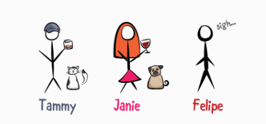
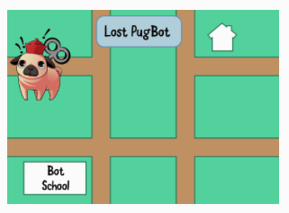

# 21. Error Handling
## First level error handling with optionals
Error handling에 대해서 깊게 배우기 전에 가장 간단한 방법을 배워보자.

### Failable initializers
object를 생성하려고 할 때, 이 작업이 실패하는 경우가 있을 수 있다.
예를 들어서, String을 Int로 바꾸는 작업을 할 때, 숫자가 아닌 String 값을 Int형으로 바꾸려고 한다면, 아마 실패할 것이다.
```swift
let value = Int("3")          // Optional(3)
let failedValue = Int("nope") // nil
``` 
또한 만약 새로운 enum type을 생성하고, 인스턴스를 생성하려고 할 때, 
컴파일러는 **failable initializer** 를 생성해줄 것이다.
```swift
enum PetFood: String {
  case kibble, canned
}

let morning = PetFood(rawValue: "kibble")  // Optional(.kibble)
let snack = PetFood(rawValue: "fuuud!")    // nil
```
Bailable initializers는 optional을 리턴한다. 만약 생성에 실패하면 nil을 리턴한다.


Failable initializer는 어떻게 생성해야 할까?
```swift
struct PetHouse {
  let squareFeet: Int
  
  init?(squareFeet: Int) {
    if squareFeet < 1 {
      return nil
    }
    self.squareFeet = squareFeet
  }
}

let tooSmall = PetHouse(squareFeet: 0) // nil
let house = PetHouse(squareFeet: 1)    // Optional(Pethouse)
```
단순히 init옆에 **?** 만 붙여주면 된다. ?를 붙이면 instance 생성이 실패할 수도 있다는 말이므로, Optional값을 리턴한다.

### Optional chaining
Force unwrapping 이나 implicitly unwrapped optional 은 optional에 값이 무조건 포함되어있을 것이라고 생각하는 경우에만 사용한다. 
```swift
class Pet {
  var breed: String?

  init(breed: String? = nil) {
    self.breed = breed
  }
}

class Person {
  let pet: Pet

  init(pet: Pet) {
    self.pet = pet
  }
}

let delia = Pet(breed: "pug")
let olive = Pet()

let janie = Person(pet: olive)
let dogBreed = janie.pet.breed! // This is bad! Will cause a crash!
```
Olive의 품종은 설정되지 않았다. (구조된지 얼마 안돼서 품종을 모른다고 생각하자).
만약 Olive의 품종을 안다고 가정하고 해당 프로퍼티를 강제 언래핑한다면 크래시가 발생할 것이다. (값이 nil인데 언래핑하면 에러가 발생함) 
이런 경우를 방지하기 위해서 앞에서 옵셔널 바인딩을 사용했었다.
```swift
if let dogBreed = janie.pet.breed {
  print("Olive is a \(dogBreed).")
} else {
  print("Olive’s breed is unknown.")
}
```
위의 코드는 옵셔널을 다룰 때 자주 사용된다. 더 복잡한 방식을 생각해보자.

```swift
class Toy {
  enum Kind {
    case ball
    case zombie
    case bone
    case mouse
  }

  enum Sound {
    case squeak
    case bell
  }

  let kind: Kind
  let color: String
  var sound: Sound?

  init(kind: Kind, color: String, sound: Sound? = nil) {
    self.kind = kind
    self.color = color
    self.sound = sound

  }
}

class Pet {
  enum Kind {
    case dog
    case cat
    case guineaPig
  }

  let name: String
  let kind: Kind
  let favoriteToy: Toy?

  init(name: String, kind: Kind, favoriteToy: Toy? = nil) {
    self.name = name
    self.kind = kind
    self.favoriteToy = favoriteToy
  }
}

class Person {
  let pet: Pet?

  init(pet: Pet? = nil) {
    self.pet = pet
  }
}
```
많은 사람들은 애완동물을 기르지만 모든 사람이 기르는 것은 아니다. 많은 애완동물들은 좋아하는 장난감이 있지만, 또 모두가 그런 것은 아니다. 장난감의 경우에도 소리가 나는게 있고 안나는게 있다.

예를 들어서, Tammy Coron는 고양이를 기른다. 그 고양이는 catnip mouse라는 장난감을 가장 좋아하며, 이 장난감은 아무 소리도 내지 않는다.

Felipe Marsetti라는  사람은 condo에서 살고 여기서는 애완동물을 기르지 못한다.
```swift
let janie = Person(pet: Pet(name: "Delia", kind: .dog, 
                   favoriteToy: Toy(kind: .ball, 
                   color: "Purple", sound: .bell)))
let tammy = Person(pet: Pet(name: "Evil Cat Overlord", 
                   kind: .cat, favoriteToy: Toy(kind: .mouse, 
                   color: "Orange")))
let felipe = Person()
```
소리를 내는 장난감을 좋아하는 애완동물을 기르고 있는 사람을 찾고싶다고 가정해보자.
여기서 사용할 수 있는 것이 **optional chaining** 이다.
그냥 nil을 리턴할 수 있는 프로퍼티나 메소드 뒤에 ?만 연속으로 붙여주면 된다.
만약 chain의 값들 중 하나라도 nil을 리턴한다면 최종 결과도 nil이 될 것이다.

```swift
if let sound = janie.pet?.favoriteToy?.sound {
  print("Sound \(sound).")
} else {
  print("No sound.")
}
```
 Janie의 애완동물은 위의 모든 조건을 만족한다. 그래서 if let 부분이 실행된다.
```swift
if let sound = tammy.pet?.favoriteToy?.sound {
  print("Sound \(sound).")
} else {
  print("No sound.")
}

if let sound = felipe.pet?.favoriteToy?.sound {
  print("Sound \(sound).")
} else {
  print("No sound.")
}
```
Tammy의 고양이의 장난감은 소리가 안나서 No sound가 출력되고, Felipe은 애완동물이 없어서 No sound 가 출력될 것이다.


### Map and compactMap
```swift
let team = [janie, tammy, felipe]
```
배열에서 애완동물 이름을 모두 알아본다고 해보자. For loop를 사용할 수도 있지만 map을 사용할 수도 있다.
```swift
let petNames = team.map { $0.pet?.name }
```
Map 연산자는 애완동물의 이름을 모두 한 배열에 넣어준다. 그리고 나서, petNames를 출력해보면 아래와 같다.
```swift
for pet in petNames {
  print(pet)
}

> print
Optional("Delia")
Optional("Evil Cat Overlord")
nil
```
만약 애완 동물이 없는 사람이 배열에 포함되어 있으면 위와 같이 nil이 출력된다.



nil을 포함시키고 싶지 않으면 filtering을 먼저 한 다음 다시 map을 호출할 수도 있지만 더 좋은 방법이 있다. 바로 **comapactMap** !!
```swift
let betterPetNames = team.compactMap { $0.pet?.name }

for pet in betterPetNames {
  print(pet)
}

> print
Delia
Evil Cat Overlord
```
map과는 달리, compactMap을 사용하면 nil이 포함되지 않는 String배열을 얻을 수 있게 된다. (원래는 [Optional<String>])


## Error protocol
Swift에는 Error 프로토콜이 있다. Error 프로토콜에는 에러를 다룰 수 있는 요소가 포함되어 있는데 만약 어떤 타입이 이 프로토콜을 채택하면 해당 타입은 error를 나타낸다.

보통은 Error를 채택할 타입은 enumeration을 사용한다. 
```swift
class Pastry{
	let flavor: String
	var numberOnHand: Int

  init(flavor: String, numberOnHand: Int) {
    self.flavor = flavor
    self.numberOnHand = numberOnHand
  }
}

enum BakeryError: Error {
  case tooFew(numberOnHand: Int)
  case doNotSell
  case wrongFlavor
  case inventory
  case noPower
}
```
Error 프로토콜은 컴파일러에게 해당 enum은 내가 던질 수 있는 에러들을 나타낸다라고 말해준다. (Swift에서는 에러가 발생한 상황에 대해서 에러를 던진다라고 표현함)

## Throwing errors
만약 에러가 발생하면, **에러를 던지고(Throwing),** 다른 곳에서 **catching(에러를 잡는다)**
```swift
class Bakery {
  var itemsForSale = [
    "Cookie": Pastry(flavor: "ChocolateChip", numberOnHand: 20),
    "PopTart": Pastry(flavor: "WildBerry", numberOnHand: 13),
    "Donut" : Pastry(flavor: "Sprinkles", numberOnHand: 24),
	  "HandPie": Pastry(flavor: "Cherry", numberOnHand: 6)
  ]
  
  func open(_ now: Bool = Bool.random()) throws -> Bool {
    guard now else {
      throw Bool.random() ? BakeryError.inventory 
                          : BakeryError.noPower
    }
    return now
  }

  func orderPastry(item: String,
                   amountRequested: Int,
                   flavor: String)  throws  -> Int {
    guard let pastry = itemsForSale[item] else {
      throw BakeryError.doNotSell
    }
    guard flavor == pastry.flavor else {
		throw BakeryError.wrongFlavor
    }
    guard amountRequested <= pastry.numberOnHand else {
      throw BakeryError.tooFew(numberOnHand: 
                               pastry.numberOnHand)
    }
    pastry.numberOnHand -= amountRequested

    return pastry.numberOnHand
  }
}
```
베이커리는 예상치 못한 이유로 문을 열지 못할 수가 있다. (재고조사나  전력 부족과 같은 이유가 무작위로 발생할 수 있음)

또한 손님이 pastry를 주문할 때, 팔지 않을 수도 있고, 손님이 원하는 맛이 아닐 수도 있고, 재고가 적을 수도 있다. 

 만약 손님이 orderPastry로 주문을 한다면, 주인은 guard문을 이용해서 위와 같은 상황을 조절해야할 필요가 있다.

위의 예시에서 볼 수 있듯이, **throw** 를 이용해서 error를 던진다. 이 에러는 Error 프로토콜을 채택한 타입의 인스턴스여야 한다. 에러를 던진 함수나 메소드는 선언할때 throws를 추가해서 내부에서 에러를 바로 처리하지 않고  다른 곳에서 에러를 처리하도록 한다.

```swift
let bakery = Bakery()
bakery.open()
bakery.orderPastry(item: "Albatross",
                   amountRequested: 1,
                   flavor: "AlbatrossFlavor")
```
위의 코드는 컴파일되지 않는다. 이유가 뭘까? 바로 에러를 캐치하는 곳이 없기 때문이다. 


## Handling errors
에러를 던졌다면 에러를 캐치하는 작업도 할 필요가 있다.
```swift
do {
  try bakery.open()
  try bakery.orderPastry(item: "Albatross",
                          amountRequested: 1,
                          flavor: "AlbatrossFlavor")
} catch BakeryError.inventory, BakeryError.noPower {
  print("Sorry, the bakery is now closed.")
} catch BakeryError.doNotSell {
  print("Sorry, but we don’t sell this item.")
} catch BakeryError.wrongFlavor {
  print("Sorry, but we don’t carry this flavor.")
} catch BakeryError.tooFew {
  print("Sorry, we don’t have enough items to fulfill your 
         order.")
}
```
에러를 던질 가능성이 있는 코드는 항상 **do** 블록 내부에서 실행이 되어야 한다. 그리고 에러가 발생하는 줄 가장 앞에 **try** 를 붙여서, 뒤에 있는 throwing function이 던지는 error를 캐치하도록 한다.

만약 에러가 발생한다면 catch블록이 실행이 되서, do 블록에서 발생한 에러를 처리하도록 한다.


### Not looking at the detailed error
만약 에러에 대해 자세히 알고 싶지 않다면, try? 를 사용해서 자세한 에러를 단지는 것 대신에 nil을 리턴하도록 한다.
nil만을 리턴하기 때문에, do-catch문을 사용할 필요가 없다.
```swift
let open = try? bakery.open(false)
let remaining = try? bakery.orderPastry(item: "Albatross",
                                        amountRequested: 1,
                                        flavor: "AlbatrossFlavor")
```


### Stoping your program on an error
그리고 만약 실패하지 않을거라는 것을 알고 있다면, 다음과 같이 try!를 사용한다.
```swift
try! bakery.open(true)
try! bakery.orderPastry(item: "Cookie", amountRequested: 1, 
                        flavor: "ChocolateChip")
```
try!는 만약 에러가 발생한다면, Runtime-error가 발생해서 프로그램이 중지될 것이다.
그래서 가급적이면 사용하지 않는 것이 좋다.


## Advanced error handling
### PugBot
작은 프로젝트를 한번 해보자. 이 프로젝트의 이름은 PugBot이다. 


pugbot은 귀엽지만 길을 잘 잃어버린다. 우리는 프로그래밍으로 퍼그봇이 코스를 벗어나면 에러를 던지도록 할 것이다.

첫번째로, PugBot이 움직일 수 있는 모든 방향을 포함한 enum을 만든다.
```swift
enum Direction {
  case left
  case right
  case forward
}
```

그리고 잘못가는 경우를 위한 에러 타입을 만들어야 한다.
```swift
enum PugBotError: Error {
  case invalidMove(found: Direction, expected: Direction)
  case endOfPath
}
```
연결 값에서는 어느 방향으로 잘못 갔는지에 대한 값도 저장할 수 있도록 한다.



```swift
class PugBot {
  let name: String
  let correctPath: [Direction]
  private var currentStepInPath = 0

  init(name: String, correctPath: [Direction]) {
    self.correctPath = correctPath
    self.name = name
  }

  func move(_ direction: Direction) throws {
    guard currentStepInPath < correctPath.count else {
      throw PugBotError.endOfPath
    }
    let nextDirection = correctPath[currentStepInPath]
    guard nextDirection == direction else {
      throw PugBotError.invalidMove(found: direction, 
                                    expected: nextDirection)
    }
    currentStepInPath += 1
  }
  
  func reset() {
    currentStepInPath = 0
  }
}
```
Pugbot을 만들때, 집으로 갈 수 있는 방향 값을 파라미터로 준다.
move(_:) 는 PugBot이 direction 의 방향으로 가도록 하는 메소드이다.
만약 이상한 방향으로 간다면 error를 던진다. 

테스트를 해보자!

```swift
let pug = PugBot(name: "Pug",
                 correctPath: [.forward, .left, .forward, .right])

func goHome() throws {
  try pug.move(.forward)
  try pug.move(.left)
  try pug.move(.forward)
  try pug.move(.right)
}

do {
  try goHome()
} catch {
  print("PugBot failed to get home.")
}
```
goHome()에서는 올바른 방향으로 가지 않으면 에러를 던지도록 한다. 

### Handling multiple errors
goHome 함수에서는 move가 던지는 에러를 받기는 하지만 직접적으로 에러를 처리하지 않는다. 대신에 goHome함수를 호출하는 곳에 error를 전달해준다.

```swift
func moveSafely(_ movement: () throws -> ()) -> String {
  do {
    try movement()
    return "Completed operation successfully."
  } catch PugBotError.invalidMove(let found, let expected) {
    return "The PugBot was supposed to move \(expected), 
            but moved \(found) instead."
  } catch PugBotError.endOfPath {
    return "The PugBot tried to move past the end of the path."
  } catch {
    return "An unknown error occurred."
  }
}
```

다음은 String값으로 무엇이 잘못되었는지를 보고해서, PugBog을 이동시키고 오류를 처리하는 기능을 가진다.
```swift
func moveSafely(_ movement: () throws -> ()) -> String {
  do {
    try movement()
    return "Completed operation successfully."
  } catch PugBotError.invalidMove(let found, let expected) {
    return "The PugBot was supposed to move \(expected), 
            but moved \(found) instead."
  } catch PugBotError.endOfPath {
    return "The PugBot tried to move past the end of the path."
  } catch {
    return "An unknown error occurred."
  }
}
```
이 함수는 goHome()과 같은 퍼그봇의 움직임과 관련된 함수를 호출을 하며, 에러를 던질 수 있는 함수를 파라미터로 가진다. 

do-catch 블록에서, 발생할 수 있는 모든 에러를 catch블록에서 처리를 해야 한다.
따라서 마지막 catch부분에서는 타입이 없는 default case를 추가하도록 한다.
만약 enum 내의 모든 Case를 모두 추가시켰다 하더라도 이 default case는 무조건 있어야 한다. (Enum 내부의 에러가 아닌 다른 에러가 발생할 수도 있으므로)
```swift
pug.reset()
moveSafely(goHome)

pug.reset()
moveSafely {
  try pug.move(.forward)
  try pug.move(.left)
  try pug.move(.forward)
  try pug.move(.right)
}
```


## Rethrows
Throwing closure를 파라미터로 받는 함수를 보자.
```swift
func perform(times: Int, movement: () throws -> ()) rethrows {
  for _ in 1...times {
    try movement()
  }
}
```
perform 함수에 rethrows를 붙이면, movement가 던진 에러를 다시 던지는 역할만 한다.
perform 함수 자체가 에러를 던지지 않고, 파라미터로 전달된 함수가 던지는 에러를 받아서 다시 던지는 역할을 한다.


## Error handling for asynchronous code
do-try-catch 는 **synchronous code** 에서만 작동한다. 만약 코드가 **asynchronously** 하게 실행된다면 에러를 던지기 위해, throw를 사용할 수 없다.

### GCD
현재 운영체제는 **multi-threaded** 환경에서 코드를 실행시킨다.
예를 들어서, 모든 네트워킹 동작은 백그라운드 쓰레드에서 실행을 해서 메인 쓰레드에서 실행되는 user interface를 막지 않는다.
 
멀티 쓰레드 환경에서는 **race condition** 의 가능성 때문에 매우 까다로울 수 있다. 한 쓰레드에서는 데이터를 쓰고, 또 다른 쓰레드에서는 해당 데이터 부분을 읽으려고 할 때, 읽는 부분에서 원하는 데이터 값을 얻지 못하는 경우도 있을 수 있다.

이런 경우를 피하기 위해서 **synchronizaion** 을 사용한다. 
Swift는 아직 concurrency model이 없지만 GCD 프레임워크에서 위의 이슈들을 좀 더 쉽게 다룰 수 있도록 한다.
> GCD는 Grand Central Dispatch의 약자로 동시적 코드 진행을 지원한다.


GCD에서는 **work queue** 의 개념이 있다. 클로저를 사용하는 queue에 작업을 집어넣으면, 해당 클로저는 작업을 다른 GCD queue로 보낼 수 있다.
* **serial** 큐는 클로저를 순서대로 수행한다.
* **concurrent** 큐는 동시에 여러 개의 클로저를 끝낼 수 있다.

위의 개념을 이해하기 위해서, execute라는 dispatch function을 생성할 것이다.
여기서는 긴 계산을 수행하는 클로저를 백그라운드 큐에서 실행하고, 나오는 결과는 메인 큐의 클로저로 전달할 것이다.
Race condition을 피하기 위해서 데이터를 공유하는 것 대신에 복사를 할 것이다.

우선 아래의 코드를 먼저 보자.
```swift
//1
func log(message: String) {
  let thread = Thread.current.isMainThread ? "Main" 
               : "Background"
  print("\(thread) thread: \(message).")
}

//2
func addNumbers(upTo range: Int) -> Int {
  log(message: "Adding numbers...")
  return (1...range).reduce(0, +)
}
```
1. log(message: )는 ternary 연산자를 이용해서 현재 스레드가 메인인지 백인지를 확인한다.
2. addNumbers(upTo:) 는 주어진 범위의 숫자들을 더한다. 백그라운드에서 실행되어야 한다.

그리고나서, 백그라운드에서 실행될 큐를 생성한다.
```swift
let queue = DispatchQueue(label: "queue")
```
**serial queue** 를 생성했고, 여기서는 **FIFO(first in first out)** 순서로 한번에 하나씩 작업을 수행한다.
> 만약 **concurrent queue** 에서 작업을 수행하고 싶다면, Concurrency by Tutorials 책을 보도록 하자.

그리고 나서, 다음의 메소드를 생성해보자.
```swift
func execute<Result>(backgroundWork: @escaping () -> Result,
                     mainWork: @escaping (Result) -> ()) {
  // 2
  queue.async {
    let result = backgroundWork()
    // 3
  DispatchQueue.main.async {
      mainWork(result)
    }
  }
}
```
순서대로 보자.
1. backgroundWork 클로저가 generic result를 리턴하기 때문에 execute 함수도 제네릭으로 만들었다. mainWork 함수는 해당 결과를 파라미터로 가진다.
두 개의 클로저는 @escaping을 사용하는데, escaping 속성을 사용하면 클로저가 함수 밖으로 빠져나갈 수 있게 된다.
2. 이전에 정의한 Serial queue에서 비동기적으로 backgroundWork 클로저를 실행한 다음 리턴 값을 저장한다.
3. 메인 큐에서 비동기적으로 mainWork 클로저를 실행하고, backgroundWork 클로저의 결과를 argument로 사용한다.


아래의 코드를 추가해보자.
```swift
execute(backgroundWork: { addNumbers(upTo: 100) },
        mainWork:       { log(message: "The sum is \($0)") })
```
백그라운드 스레드에서 숫자를 더하고 해당 결과를 메인 스레드에서 콘솔에 결과를 출력한다.
```swift
Background thread: Adding numbers...
Main thread: The sum is 5050.
```


### Result
위에서 비동기 함수에서 던져진 에러를 캡쳐하기 위해서 Swift standard library에  정의된 Result 타입을 사용한다.
```swift
enum Result<Success, Failure> where Failure: Error {
  case success(Success)
  case failure(Failure)
}
``` 
위에서 Failure는 무조건 Error를 채택해야 한다.
위의 타입이 어떻게 작동하는지를 보자.
```swift
// 1
struct Tutorial {
  let title: String
  let author: String
}

// 2
enum TutorialError: Error {
  case rejected
}

// 3
func feedback(for tutorial: Tutorial) -> Result<String, 
                                                TutorialError> {
  Bool.random() ? .success("published") : .failure(.rejected)
}
```
1. Tutorial 구조체에 title, author 프로퍼티를 추가한다.
2. 거부된 튜토리얼(잘못 쓰여있거나, 4000 단어가 넘으면)에 대한 TutorialError 열거형을 생성한다.
3. feedback 함수에서는 random()을 사용해서, true이면 .success(“published”)를 리턴하거나 false이면 .failure(.rejected) 를 리턴한다. 
```swift
func edit(_ tutorial: Tutorial) {
  queue.async {
    // 1
    let result = feedback(for: tutorial)
    DispatchQueue.main.async {
      switch result {
        // 2
        case let .success(data):
          print("\(tutorial.title) by \(tutorial.author) was 
                 \(data) on the website.")
        // 3
        case let .failure(error):
          print("\(tutorial.title) by \(tutorial.author) was 
                 \(error).")
      }
    }
  }
}

let tutorial = Tutorial(title: "What’s new in Swift 5.1", 
                        author: "Cosmin Pupăză")
edit(tutorial)
```
1. feedback(for:)는 비동기적으로 큐에서 실행되고 result를 저장한다.
2. 만약 tutorial을 출판한다면 메인큐에서 비동기적으로 적절한 메세지를 출력한다.
3. 만약 tutorial이 거부된다면 메인 큐에서 비동기적으로 error를 다루도록 한다.
```swift
let result = feedback(for: tutorial)
do {
  let data = try result.get()
  print("\(tutorial.title) by \(tutorial.author) was 
         \(data) on the website.")
} catch {
  print("\(tutorial.title) by \(tutorial.author) was \(error).")
} 
```
do-try-catch에서도 Result를 사용할 수 있다.
get()은 result의 값을 리턴한다. 그리고 나서 적절한 값이 없다면 error를 다루도록 한다.


