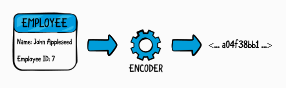

# 22. Encoding & Decoding Types
이번 챕터에서는 Employee 같은 타입들이 bytes로 바뀌는 방식을 배울 것이다.
이러한 과정을 encoding이라고 하며, **serialization** 이라고도 한다.

반대의 경우, 데이터를 instance로 바꾸는 것을 decoding이라고 하며, **deserialization** 이라고 한다.

파일에 쓰고 싶은 instance가 있다고 해보자. instance 자체는 파일에 바로 쓰일 수가 없기 때문에 stream of bytes와 같이 다른 방식으로 쓸 필요가 있다.



데이터가 인코딩되고 파일에 저장이 되면, 이것을 다시 decoder를 이용해서 원하는 instance로 다시 되돌리는 것도 가능하다.


## Encodable and Decodable protocols
Encodable 프로토콜은 type이 다른 방식으로 바뀔 수 있다고 말해준다.
```swift
func encode(to: Encoder) throws
```
만약 모든 stored property가 Encodable을 채택하고 있다면 컴파일러는 자동으로 encoding을 해준다.

Decodable 프로토콜은 다른 형태에서 type으로 바꿀 수 있다고 말해준다.
```swift
init(from decoder: Decoder) throws
```
컴파일러는 모든 stored properties가 Decodable을 채택한다면 컴파일러는 위의 생성자를 만들 것이다.

## What is Codable?
Codable은 어떤 타입이 인코딩과 디코딩이 같이 될 수 있다고 알려주는 프로토콜이다.
```swift
typealias Codable = Encodable & Decodable
```

## Automatic encoding and decoding
Swift에서 Int, String, Date, Array 등의 타입들은 모두 codable이다.
만약 직접 생성한 타입을 codable로 설정하고 싶다면, Codable 프로토콜을 채택하도록 하면 된다.

```swift
struct Employee{
	var name: String
	var id: Int
}
```
위의 타입을 인코딩하고 디코딩하고 싶다면 그냥 Codable 프로토콜을 채택한다고 명시해주기만 하면 된다.
```swift
struct Employee: Codable {
  var name: String
  var id: Int
}
```
name(String)과 id(Int)가 Codable을 채택하고 있기 때문에 Employee 구조체도 Codable을 채택할 수 있게 되었다.

만약 Employee 구조체가 다른 custom 타입의 프로퍼티를 가질때는 어떨까?                       
예를 들어서, Employee 구조체에 favoirteToy 옵셔널 프로퍼티를 추가한다고 해보자.
```swift
struct Employee: Codable {
  var name: String
  var id: Int
  var favoriteToy: Toy?
}

struct Toy: Codable {
  var name: String
}
```
favoriteToy의 타입인 Toy 또한 Codable 프로토콜을 채택해야지만 Employee가 Codable프로토콜을 채택할 수 있다.


## Encoding and decoding custom types
인코딩, 디코딩할 수 있는 표현들이 많지만 이번 챕터에서는 JSON을 가지고 인코딩과 디코딩을 배워보자.

JSON을 인코딩할 때는 JSONEncoder를 사용하고, 디코딩할때는 JSONDecoder를 사용한다.

만약 Employee 인스턴스를 JSON형태로 인코딩한다고 해보자.
Json 형태는 다음과 같다.
```swift
{ "name": "John Appleseed", "id": 7 }
```


### JSONEncoder and JSONDecoder
Codable을 채택했다면, JSONEncoder를 이용해서 타입을 Data 형식으로 바꿀 수 있다. (Data형식은 파일에 써질 수 있는 형식 or 네트워크에 보낼 수 있는 형식)

```swift
let toy1 = Toy(name: "Teddy Bear");
let employee1 = Employee(name: "John Appleseed", id: 7, favoriteToy: toy1)
```
위의 데이터를 서버로 보내기 위해서는, 먼저 인코딩 과정이 필요하다.
```swift
let jsonEncoder = JSONEncoder()
let jsonData = try jsonEncoder.encode(employee1)
```
encode(_:)는 throwing function 이기 때문에 try 를 붙여줘야 한다.
(ending이 실패할 수도 있음)
만약 jsonData를 string 형식으로 읽고 싶다면, String initializer를 이용하면 된다.
```swift
let jsonString = String(data: jsonData, encoding: .utf8)!
print(jsonString)
// {"name":"John Appleseed","id":7,"favoriteToy":{"name":"Teddy Bear"}}
```

만약 서버에섯 보낸 json 파일을 원하는 instance 형식으로 바꾸고 싶다면,
JSONDecoder를 이용하면 된다.
```swift
let jsonDecoder = JSONDecoder()
let employee2 = try jsonDecoder.decode(Employee.self, from: jsonData)
```
decoder에게 어떤 타입에 대해 디코딩할지 알려주기 위해서 ,Employee.self를 추가해준다.


## Renaming properties with CodingKeys
CodingKeys는 CodingKey 프로토콜을 채택한 enumeration이다.
만약 json 파일의 key값과 타입 이름이 다른 경우를 위해서 사용한다.

```swift
struct Employee: Codable {
  var name: String
  var id: Int
  var favoriteToy: Toy?

  enum CodingKeys: String, CodingKey {
    case id = "employeeId"
    case name
    case favoriteToy
  }
}
```
1. CodingKeys는 custom type의 nested enumeration으로 작성한다.
2. CodingKey 프로토콜을 채택해야 한다.
3. Raw type은 String으로 설정한다. (key값은 보통 string으로 되어있음)
4. enumeration에는 모든 property들이 case로 존재해야 한다.
5. 이 enum은 컴파일러에 의해 기본으로 생성되는 것이지만, key의 이름을 다시 설정할 때는 직접 구현해야 한다.
 
enum을 추가한 후에 JSON을 프린트해보면, 
```swift
{ "employeeId": 7, "name": "John Appleseed", "favoriteToy": {"name": "Teddy Bear"}}
```
id가 employeeId로 변경된 것을 볼 수 있다.


## Manual encoding and decoding
만약 서버에서 다음과 같은 형태의 json을 원한다고 하면 어떻게 해야 할까.?
```swift
{ "employeeId": 7, "name": "John Appleseed", "gift": "Teddy Bear" }
```
Nested type(Toy)가 아닌 “gift” 의 이름의 프로퍼티를 원한다고 가정해보자.
이 부분은 CodingKeys로는 해결이 되지 않는다. 대신에, JSON의 구조를 바꿔야 한다.

### The encode function
위의 상황을 위해서 encode(to: Encoder) 메소드를 다시 구현해야 한다.
첫번째로, CodingKeys를 favoriteToy 대신 gift로 바꿔준다.
```swift
enum CodingKeys: String, CodingKey {
  case id = "employeeId"
  case name
  case gift
}
```
그리고 나서 Employee의 Codable 채택을 삭제하고 다음의 extension을 추가한다.
```swift
extension Employee: Encodable {
  func encode(to encoder: Encoder) throws {
    var container = encoder.container(keyedBy: CodingKeys.self)
    try container.encode(name, forKey: .name)
    try container.encode(id, forKey: .id)
    try container.encode(favoriteToy?.name, forKey: .gift)
  }
}
```
인코딩된 데이터는 Encodeer내부에서 container의 형태로 저장이 된다.
이 container의 encode 메소드를 이용해서, 각 키에 대한 인코딩을 각각 진행해준다.
이 메소드는 첫번째 파라미터로 전달한 속성을 두번째 파라미터로 전달한 key와 매핑시켜서 컨테이너에 저장한다.

여기가지 하면 다음의 메세지를 얻는다.
```swift
Employee' does not conform to expected type 'Decodable'
```
Codable 채택을 지웠기 때문에 생기는 오류인데, Codable 채택을 한 곳에서 같은 방식으로 진행하면 다음의 결과를 얻을 수 있다.
```swift
{"name":"John Appleseed","gift":"Teddy Bear","employeeId":7}
```


### The decode function
서버에서 데이터가 도착하면 원하는 instance로 바꿀 수 있어야 한다.
```swift
extension Employee: Decodable {
  init(from decoder: Decoder) throws {
    let values = try decoder.container(keyedBy: CodingKeys.self)
    name = try values.decode(String.self, forKey: .name)
    id = try values.decode(Int.self, forKey: .id)
    if let gift = try values.decode(String?.self, forKey: .gift) {
      favoriteToy = Toy(name: gift)
    }
  }
}
```
위에서 설정한 gift의 형태는 기존의 struct의 형태와는 다르다.
따라서 디코딩할때도 인코딩할때와 마찬가지로 decode 함수의 형태를 바꿔줘야 한다.
디코딩 또한 container의 decode 메소드를 이용하여서 첫번째 파라미터로 디코딩할 형식을 전달해주고 두번째 파라미터로 enum case를 전달해준다.


### encodeIfPresent and decodeIfPresent
만약 속성이 옵셔널인 경우에는 어떻게 해야 할까?
여기서 encode가 아닌 encodeIfPresent를 사용해야 한다.
```swift
extension Employee: Encodable {
  func encode(to encoder: Encoder) throws {
    var container = encoder.container(keyedBy: CodingKeys.self)
    try container.encode(name, forKey: .name)
    try container.encode(id, forKey: .id)
    try container.encodeIfPresent(favoriteToy?.name, forKey: .gift)
  }
}
```
또한 decode 가 아닌 decodeIfPresent를 사용해야 한다.
```swift
extension Employee: Decodable {
  init(from decoder: Decoder) throws {
    let values = try decoder.container(keyedBy: CodingKeys.self)
    name = try values.decode(String.self, forKey: .name)
    id = try values.decode(Int.self, forKey: .id)
    if let gift = try values.decodeIfPresent(String.self, forKey: .gift) {
      favoriteToy = Toy(name: gift)
    }
  }
}
```


## Writing tests for the Encoder and Decoder
만약 encode는 바꿨는데 decoder는 까먹고 바꾸지 않았을 경우가 있을 수 있다. 이렇게 되면 런타임에 에러가 발생하게 된다.

이런 상황을 피하기 위해서 unit test를 활용한다.
```swift
import XCTest
```
그리고 test class를 추가하고 setUp 메소드 내부에서 JSONEncoder와 JSONDecoder를 생성한다.

또한 하나의 Toy와 하나의 Employee instance를 생성한다.

아래의 코드를 추가한다.
```swift
class EncoderDecoderTests: XCTestCase {
  var jsonEncoder: JSONEncoder!
  var jsonDecoder: JSONDecoder!
  var toy1: Toy!
  var employee1: Employee!

  override func setUp() {
    super.setUp()
    jsonEncoder = JSONEncoder()
    jsonDecoder = JSONDecoder()
    toy1 = Toy(name: "Teddy Bear")
    employee1 = Employee(name: "John Appleseed", id: 7,
                         favoriteToy: toy1)
  }
```

다음으로 test를 추가해보자.
EncoderDecodertests 클래스 내부에 다음을 추가한다.
```swift
func testEncoder() {
  let jsonData = try? jsonEncoder.encode(employee1)
  XCTAssertNotNil(jsonData, "Encoding failed")
  
  let jsonString = String(data: jsonData!, encoding: .utf8)!
  XCTAssertEqual(jsonString, "{\"name\":\"John Appleseed\",\"gift\":\"Teddy Bear\",\"employeeId\":7}")
}

func testDecoder() {
  let jsonData = try! jsonEncoder.encode(employee1)
  let employee2 = try? jsonDecoder.decode(Employee.self, from: jsonData)
  XCTAssertNotNil(employee2)
  
  XCTAssertEqual(employee1.name, employee2!.name)
  XCTAssertEqual(employee1.id, employee2!.id)
  XCTAssertEqual(employee1.favoriteToy?.name,
                 employee2!.favoriteToy?.name)
}
```
XCTAssert 메소드를 사용해서 test를 진행하였다.
XCTAssertNotNil을 통해서 nil인지 아닌지를 체크하고,
XCTAssertEqual을 통해 두 개의 파라미터가 같은지를 체크하였다.

테스트를 실행하기 위해 다음의 코드를 추가하자.!
```swift
EncoderDecoderTests.defaultTestSuite.run()
```
```swift
Test Suite 'EncoderDecoderTests' started at ...
Test Case '-[__lldb_expr_2.EncoderDecoderTests testDecoder]' started.
Test Case '-[__lldb_expr_2.EncoderDecoderTests testDecoder]' passed (0.781 seconds).
Test Case '-[__lldb_expr_2.EncoderDecoderTests testEncoder]' started.
Test Case '-[__lldb_expr_2.EncoderDecoderTests testEncoder]' passed (0.004 seconds).
Test Suite 'EncoderDecoderTests' passed at ...
   Executed 2 tests, with 0 failures (0 unexpected) in 0.785 (0.788) seconds
```


## Key points
* 파일에 저장하거나 서버에 보내기 전에 instance를 인코딩해야 한다.
* 서버나 파일에서 데이터를 보내면 instance에 저장하기 위해 디코딩해야 한다.
* 인코딩과 디코딩을 지원하기 위해서, 타입은 무조건 Codable 프로토콜을 채택해야 한다.
* 커스텀 타입의 모든 stored property가 Codable이면, 컴파일러는 자동으로 Codable 프로토콜의 요구사항을 구현해준다.
* JSON은 가장 흔하게 사용되는 인코딩이다. 커스텀 타입과 JSON을 인코딩하거나 디코딩하기 위해서는 JSONEncoder, JSONDecoder가 필요하다.


